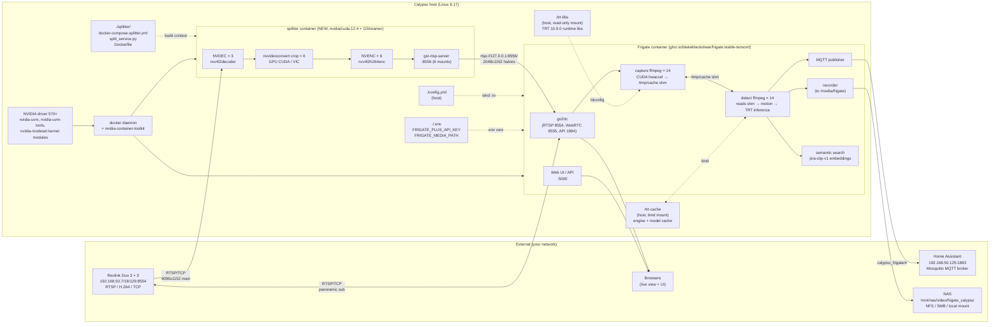
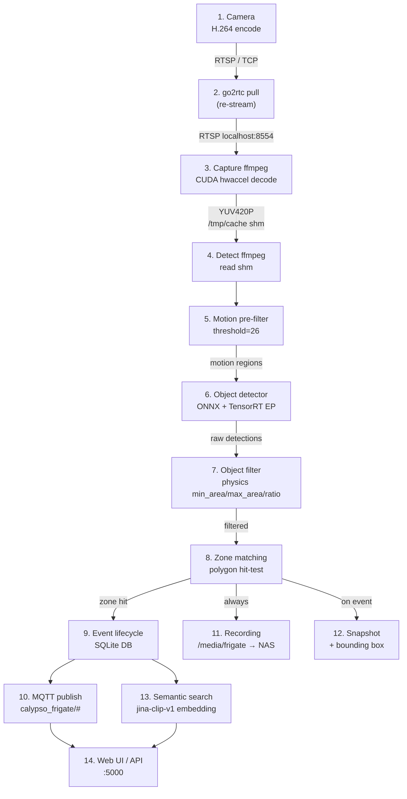
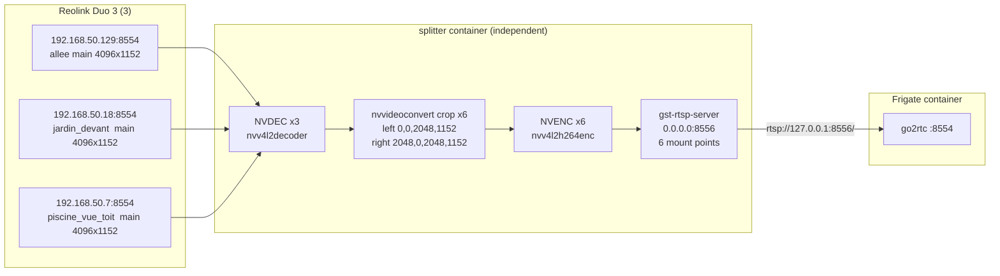
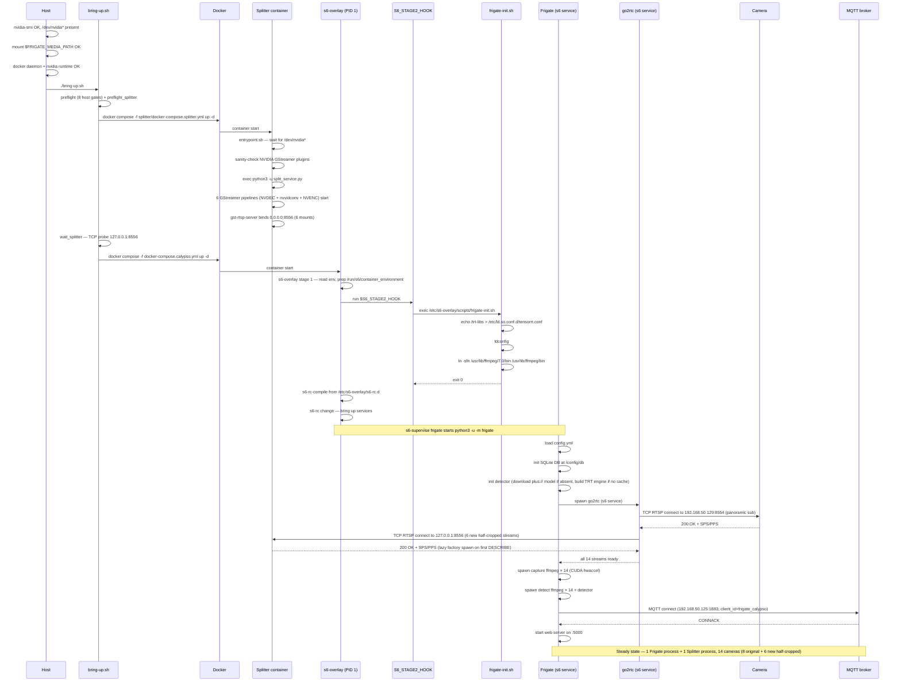
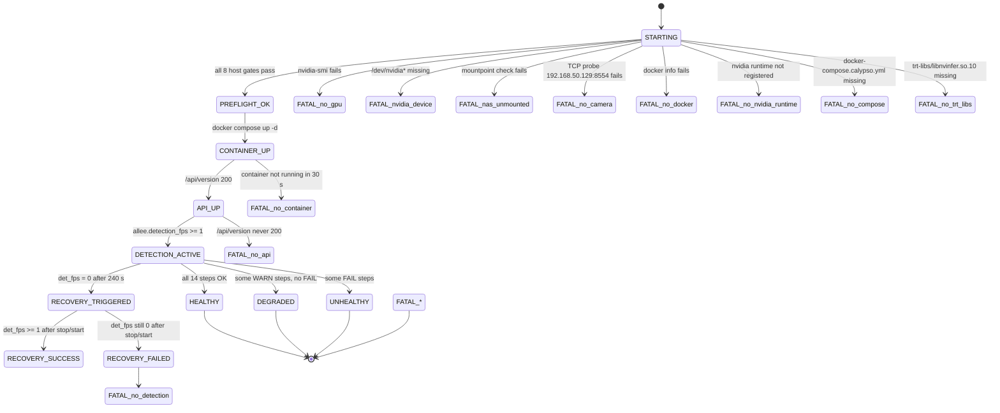

# Frigate NVR — Architecture

End-to-end documentation of the Frigate NVR pipeline running on **Calypso** (host with RTX 5060 Ti 16 GB). This document covers every stage from the physical Reolink camera to the MQTT event published on the Home Assistant broker, with a focus on **who** runs **where**, **when** in the sequence, **how** the data flows, and **why** each stage exists.

> For the manual startup procedure, see [STARTUP.md](STARTUP.md). For the automated bring-up, see [bring-up.sh](bring-up.sh).

---

## 1. System context



> The **splitter container** (added 2026-06-03 with the half-cropped
> cameras) is independent of Frigate. It GPU-decodes the 3 Reolink Duo 3
> main streams (4096×1152 panoramic), crops each into two 2048×1152
> (16:9) halves, and re-publishes the 6 halves as RTSP on port 8556.
> Frigate's go2rtc pulls the 6 new streams just like the panoramic
> sub-streams. See [§ 4.0](#40-splitter-service) for the full pipeline
> details and [splitter/README.md](splitter/README.md) for the service
> contract.
>
> The original 3 panoramic cameras (allee_sur_le_cote, jardin_devant,
> piscine_vue_toit) stay in Frigate with their `*_sub` streams for the
> live overview + audio role; the 6 new half-cropped cameras get
> detect + record + audio + live via the splitter's RTSP mounts.
> Total Frigate cameras: 14.

---

## 2. Container layout

The single `frigate` container, configured by [`docker-compose.calypso.yml`](docker-compose.calypso.yml), exposes the following layout:

### 2.1 Process tree (logical)

The container is an **s6-overlay v3** image. PID 1 is the s6 supervisor, not Frigate; Frigate is one of several s6-managed services.

```
s6-svscan                                    (PID 1, from /init)
├── s6-supervise frigate
│   └── python3 -u -m frigate                 (the canonical Frigate process)
│       ├── go2rtc                            (subprocess)
│       ├── capture process                   (per camera, ffmpeg + ZMQ)
│       │   └── ffmpeg (CUDA hwaccel)
│       ├── detect process                    (per camera, ffmpeg + ZMQ)
│       │   ├── ffmpeg (reads from /tmp/cache shm)
│       │   └── onnxruntime + TensorRT EP
│       ├── mqtt publisher                    (thread)
│       ├── recorder                          (thread)
│       ├── web server (uvicorn)              (thread)
│       └── semantic search worker            (thread)
├── s6-supervise frigate-log
│   └── s6-log → /dev/shm/logs/frigate
├── s6-supervise go2rtc   (and go2rtc-log, go2rtc-healthcheck)
├── s6-supervise nginx    (and nginx-log)
└── s6-supervise certsync (and certsync-log)
```

A one-shot init script runs **once before s6-rc brings the services up** (see [§2.3](#23-container-init--s6-overlay-v3--stage-2-hook)):

```
s6-overlay stage 2 init (/run/s6/basedir/scripts/rc.init)
└── $S6_STAGE2_HOOK → /etc/s6-overlay/scripts/frigate-init.sh
    ├── echo /trt-libs > /etc/ld.so.conf.d/tensorrt.conf
    ├── ldconfig
    └── ln -sfn /usr/lib/ffmpeg/7.0/bin /usr/lib/ffmpeg/bin
```

Capture and detect processes communicate via **ZMQ IPC sockets** bound to the container's shared-memory filesystem.

### 2.2 Container resources

| Resource | Value | Source in [compose](docker-compose.calypso.yml) |
|---|---|---|
| Image | `ghcr.io/blakeblackshear/frigate:stable-tensorrt` | `image:` |
| Network | host (no NAT) | `network_mode: host` |
| shm (`/dev/shm`) | 5 GB | `shm_size: "5120m"` |
| tmpfs `/tmp/cache` | 2 GB | `tmpfs:` block |
| Volumes | 6 (config, media, trt-cache, trt-libs ro, **frigate-init.sh ro**, tmpfs) | `volumes:` block |
| Devices | 5 nvidia devices | `devices:` block |
| Runtime | `nvidia` | `runtime: nvidia` |
| Env vars | 6 (TZ, NVIDIA×2, PLUS_API_KEY, FRIGATE_LOG_LEVEL, **S6_STAGE2_HOOK**) | `environment:` block |

### 2.3 Container init — s6-overlay v3 + stage-2 hook

The Frigate image is an **s6-overlay v3** image. The image's
`ENTRYPOINT` is `/init` (s6-overlay's own PID-1) and its `CMD` is
`null`. The container is therefore started by s6, which:

1. runs s6-overlay's stage 2 init script
   (`/run/s6/basedir/scripts/rc.init`) to bring up the compiled
   s6-rc service tree, **and**
2. executes the stage-2 hook (`$S6_STAGE2_HOOK`) **once**,
   **before** `s6-rc change` brings up any service.

After services are up, no CMD is run, so the container stays
alive as long as s6 does. The services the s6-rc tree manages
are defined in `/etc/s6-overlay/s6-rc.d/` inside the image and
include `frigate` (s6-supervised), `go2rtc`, `nginx`,
`certsync`, and their `*-log` logger halves. The `frigate`
service is the canonical Frigate process — a single
`python3 -u -m frigate` spawned and supervised by s6, restarted
by s6 if it ever exits.

Container init does one extra thing before the services start:
it must register the host-provided TensorRT 10.9.0 runtime
libraries and the ffmpeg 7.0 symlink. We do that via the
s6-overlay stage-2 hook, **not** via a `command:` override:

```sh
# frigate-init.sh — bind-mounted into the container at
# /etc/s6-overlay/scripts/frigate-init.sh:ro (see §6.2)
# Invoked by rc.init as $S6_STAGE2_HOOK, once, before s6-rc change.

echo '/trt-libs' > /etc/ld.so.conf.d/tensorrt.conf
ldconfig
ln -sfn /usr/lib/ffmpeg/7.0/bin /usr/lib/ffmpeg/bin
```

| Step | What runs | Why |
|---|---|---|
| Container start | `/init` (s6-overlay v3) | PID 1 — supervises everything below |
| Stage 1 (s6-overlay) | read env, chmod `/run/s6/container_environment` | standard s6-overlay setup |
| **Stage 2 hook** | `frigate-init.sh` via `$S6_STAGE2_HOOK` | registers `/trt-libs` in `ld.so.conf.d` (so the s6-supervised Frigate finds host-provided `libnvinfer.so.10`) and symlinks `/usr/lib/ffmpeg/bin` → `7.0/bin` (so Frigate's `ffmpeg.path` resolution finds the binary). The `stable-tensorrt` image ships `libonnxruntime_providers_tensorrt.so` but **not** `libnvinfer.so.10`; the host provides them via the `./trt-libs:/trt-libs:ro` mount. The ffmpeg image ships ffmpeg at `…/7.0/bin/ffmpeg`; Frigate treats `ffmpeg.path` as a directory and appends `/bin/ffmpeg` automatically, so the symlink bridges the version-suffixed path. |
| Stage 2 (s6-overlay) | `s6-rc-compile` then `s6-rc change` | brings up the `frigate`, `go2rtc`, `nginx`, `certsync` services |
| Steady state | `s6-supervise frigate` runs `python3 -u -m frigate` | single Frigate process, s6-managed |

> **Why not a `command:` override?** Earlier versions of this
> compose file passed
> `sh -c "... && exec python3 -u -m frigate"` as the container
> CMD. s6-overlay v3 runs the CMD **in addition to** the s6
> services, so the CMD's `exec python3 -u -m frigate` spawned a
> *second* Frigate alongside the s6-supervised one. Both loaded
> the same `config.yml` and connected to MQTT with the same
> `client_id`, kicking each other off the broker every ~1 s
> ("session taken over" — see §5.5 troubleshooting for the
> historical symptom). Killing the duplicate also killed the
> container, because s6-overlay v3's `rc.init` halts the
> container when the CMD exits. The `S6_STAGE2_HOOK` pattern
> avoids both problems: there is no CMD, so there can be no
> duplicate, and the init runs before s6-rc brings up services
> so the s6-supervised Frigate inherits the right `ld.so.conf`
> and ffmpeg symlink.

### 2.4 Ports (network_mode: host)

| Port | Purpose | Bound by |
|---|---|---|
| **5000** | Frigate web UI + REST API | `frigate` (uvicorn) |
| **8554** | go2rtc RTSP re-stream | `go2rtc` (inside the Frigate container) |
| **8555** | go2rtc WebRTC (browser live view) | `go2rtc` |
| **1984** | go2rtc API + UI | `go2rtc` |
| **8556** | **splitter RTSP re-stream** (6 half-cropped mounts, 2048×1152) | `splitter` container (added 2026-06-03) |

---

## 3. End-to-end pipeline (data flow)

The 14 stages below trace a single frame from the camera lens to a published MQTT event.



---

## 4. Per-stage details

### 4.0 Splitter service (Reolink Duo 3 half-cropper)

| | |
|---|---|
| **Who** | The `splitter` container, a dedicated, independent-of-Frigate service that GPU-decodes the 3 Reolink Duo 3 main streams (4096×1152 panoramic) and crops each into two 2048×1152 (16:9) halves |
| **Where** | A separate docker container on the Calypso host. `network_mode: host`; binds `0.0.0.0:8556` directly. Reachable by Frigate as `rtsp://127.0.0.1:8556/<mount>`. |
| **When** | Started by `bring-up.sh`'s `start_splitter_container()` step **BEFORE** the Frigate container, so the 6 new streams are ready when go2rtc pulls. The watchdog re-creates the container if it dies. |
| **What** | 6 GStreamer pipelines (one per half-cropped camera), each running: `rtspsrc → rtph264depay → h264parse → nvv4l2decoder (NVDEC) → nvvidconv left=<0|2048> top=0 width=2048 height=1152 (CUDA crop) → nvv4l2h264enc (NVENC) → h264parse → rtph264pay`. Hosted behind a single `gst-rtsp-server` on port 8556. |
| **Config** | `splitter/split_service.py` (PIPELINES list of 6 entries), `splitter/Dockerfile`, `splitter/docker-compose.splitter.yml` |
| **GPU** | 3× NVDEC (one per Reolink main stream, 4K each) + 6× nvvidconv (CUDA crop) + 6× NVENC (H.264 encode). CPU only does the RTSP handshake and the GStreamer bus. |
| **Why a separate service** | (1) **Independent lifecycle** — the splitter can be restarted / upgraded without touching Frigate. (2) **GPU isolation** — the splitter's NVDEC + NVENC is decoupled from Frigate's TRT inference. (3) **Reusability** — the 6 RTSP streams are consumable by any RTSP client (Frigate, Home Assistant, OBS, browser). (4) **Failure containment** — if the splitter dies, the 3 original panoramic cameras + the 2 single-lens Reolink cameras + the 3 indoor Tapo cameras all keep working. |
| **Mount points** | `/allee_sur_le_cote_left`, `/allee_sur_le_cote_right`, `/jardin_devant_left`, `/jardin_devant_right`, `/piscine_vue_toit_left`, `/piscine_vue_toit_right` — all on `rtsp://127.0.0.1:8556/<mount>` |
| **Failure** | If a Reolink upstream dies, the corresponding 2 pipelines go into ERROR. gst-rtsp-server returns 503 on the affected mount points; the other 4 keep serving. Frigate's go2rtc will retry. If the entire container dies, the 6 new cameras in Frigate go into "disabled" state; the watchdog re-creates the container within 5 min (timer interval). |



See [splitter/README.md](splitter/README.md) for the full service contract (env vars, troubleshooting, GPU usage breakdown, RTSP mount table).

### 4.1 Reolink camera (RTSP source)

| | |
|---|---|
| **Who** | Hardware H.264 encoder on the **Reolink Duo 3 Wi-Fi/ETH** |
| **Where** | Physical camera, IP `192.168.50.129`, RTSP port `8554` |
| **When** | Always on (independent of host) |
| **What** | H.264 video, two streams: `main` (4096×1152) and `sub` (1536×432). Auth: `admin:fG-56lui`. |
| **Why** | Source of all video data. The camera's embedded web UI controls exposure, IR, and motion regions — Frigate does not configure these. |
| **Failure** | If unreachable, go2rtc retries with exponential backoff; Frigate logs `rtsp_reader: failed to connect` and the camera goes into a "disabled" state until reconnect. |

### 4.2 go2rtc (internal re-streamer)

| | |
|---|---|
| **Who** | The `go2rtc` process started by Frigate's main Python process |
| **Where** | Inside the container, listening on `127.0.0.1:8554` (RTSP), `0.0.0.0:8555` (WebRTC), `0.0.0.0:1984` (API/UI). Since `network_mode: host`, all are reachable on the host. |
| **When** | Started early in Frigate's init, after config load and before any camera capture begins |
| **What** | Maintains **one TCP RTSP upstream connection** to the camera per `go2rtc.streams` entry, then **serves any number of downstream clients** (capture ffmpeg, browser WebRTC) without re-connecting upstream. |
| **Config** | [`go2rtc:`](config.yml) in [config.yml](config.yml) — `webrtc.candidates: [192.168.50.150:8555, stun:8555]` for ICE, `streams.allee_sur_le_cote_sub: [rtsp://admin:fG-56lui@…/h264Preview_01_sub]` |
| **Why** | (1) Reuses one upstream connection (lower camera load). (2) Translates RTSP → MSE / WebRTC for browsers. (3) Standardises the path Frigate uses (`rtsp://127.0.0.1:8554/<name>`). |
| **WebRTC** | WebRTC achieves sub-200 ms latency (vs ~1 s for MSE). The `192.168.50.150:8555` candidate is the Calypso LAN IP; `stun:8555` is the STUN discovery for external clients. |

### 4.3 Capture ffmpeg (per camera, per role)

| | |
|---|---|
| **Who** | An `ffmpeg` subprocess spawned by Frigate's capture process |
| **Where** | Inside the container. Reads from `rtsp://127.0.0.1:8554/allee_sur_le_cote_sub` (go2rtc re-stream), writes decoded frames to `/tmp/cache` (tmpfs, 2 GB) |
| **When** | Started after go2rtc confirms the upstream is connected; one ffmpeg per `(camera, role-group)` — here a single sub-stream feeds all three roles (detect, record, audio) so only one ffmpeg runs |
| **What** | `ffmpeg -hwaccel cuda -hwaccel_device 0 -i <rtsp> -f rawvideo -pix_fmt yuv420p /tmp/cache/camera-uuid` |
| **Config** | [`ffmpeg:`](config.yml) at top level (`hwaccel_args`) + [`cameras.allee_sur_le_cote.ffmpeg.inputs`](config.yml) (the `roles: [detect, record, audio]` unifies all roles onto the sub-stream) |
| **Why** | (1) **GPU decode** (`-hwaccel cuda`) avoids burning CPU. (2) **YUV420P rawvideo** to shm is the fastest IPC format (no re-encode, no container-network round-trip). (3) **Sub-stream** is the smallest stream that still covers the entire field, minimising GPU decode work. |
| **Failure** | If ffmpeg exits, capture process restarts it. go2rtc continues serving the re-stream, so restart is fast. |

### 4.4 Shared memory (capture → detect IPC)

| | |
|---|---|
| **Who** | Linux POSIX shared memory, written by capture ffmpeg, read by detect ffmpeg |
| **Where** | Container filesystem, mounted as tmpfs at `/tmp/cache` (size 2 GB). Also a separate shm at `/dev/shm` (5 GB) for general Python ↔ Python ZMQ IPC. |
| **When** | Continuously; each frame written by capture, picked up by detect within one frame interval |
| **What** | Raw YUV420P frame buffers, frame-metadata sidecar (timestamp, frame_id, motion mask) |
| **Why** | (1) Avoids a container network round-trip. (2) Allows detect to **fall behind** during heavy inference without dropping capture frames (small backlog). (3) Decouples capture and detect lifecycles — a detect process restart does not affect capture. |
| **Failure** | If the tmpfs fills (2 GB) capture blocks waiting for detect to free frames. Mitigated by the 2 GB cap (intentionally large enough for several seconds of buffer at 1536×432 YUV420P ≈ 1 MB/frame at 5 fps ≈ 5 MB/s). |

### 4.5 Detect ffmpeg (per camera, in-process)

| | |
|---|---|
| **Who** | The `detect` Python process's internal ffmpeg consumer |
| **Where** | Inside the container, runs in the same process as the detector |
| **When** | Subscribes to capture output as soon as the first frame is in `/tmp/cache` |
| **What** | Reads YUV420P frames, applies motion pre-filter, crops motion regions, runs the detector on those crops |
| **Why** | **Detect runs only on motion regions** (not every frame) — this is the single biggest GPU-time saver. At 5 fps detect-fps on a quiet scene, GPU usage is ~5% instead of ~80%. |

### 4.6 Motion pre-filter

| | |
|---|---|
| **Who** | Frigate's internal `motion` module, in the detect process |
| **Where** | Container, runs on every frame the detect ffmpeg consumer reads |
| **When** | Before the (expensive) object detector |
| **What** | Background subtractor + contour detection. Outputs a binary mask of "moving pixels" |
| **Config** | [`motion:`](config.yml) at top level: `threshold: 26`, `contour_area: 30`, `frame_alpha: 0.4`, `delta_alpha: 0.5`, `improve_contrast: true` |
| **Why** | Cheap (CPU-only) filter that rejects ~95% of frames before they reach the GPU. Without it, the detector would run on every frame and saturate the GPU. |

### 4.7 Object detector (ONNX Runtime + TensorRT EP)

| | |
|---|---|
| **Who** | The `onnx1` detector (config name), running onnxruntime 1.22+ with the TensorrtExecutionProvider |
| **Where** | Inside the container, in the detect process. Uses host GPU via the `nvidia` runtime and 5 device passthroughs. |
| **When** | On every frame that has motion regions above `motion.contour_area` |
| **What** | Runs the **Frigate+ custom model** (`plus://6ea1f38db36e21f44a1eb1071d9958ed`) on each motion crop. Returns `(class, score, bbox)` for each candidate. |
| **Config** | [`detectors.onnx1:`](config.yml) (`type: onnx`, `device: "Tensorrt"`), [`model:`](config.yml) (the `plus://` URL) |
| **Why TRT** | The `stable-tensorrt` image + `device: "Tensorrt"` runs the model through TensorRT 10.9.0's optimized kernels. Inference is ~6-8 ms per crop on RTX 5060 Ti, vs ~120 ms on CPU. |
| **Engine cache** | The TRT engine is **built on first run** (~65 s) and persisted at `trt-cache/tensorrt/ort/trt-engines/` (host: `./trt-cache`, container: `/config/model_cache`). Subsequent runs load the engine in <1 s. |
| **Failure fallback** | If TRT build fails (unsupported kernel, OOM, etc.), set `device: "CPU"` in [config.yml](config.yml) and restart — inference drops to ~120 ms but detection still works. |

### 4.8 Object filter (physics-based)

| | |
|---|---|
| **Who** | Frigate's filter engine, in the detect process |
| **Where** | Container, runs immediately after the detector |
| **When** | For every raw detection |
| **What** | Drops detections that don't pass `min_area`, `max_area`, `min_ratio`, `max_ratio`, `threshold`, `min_score` |
| **Config** | [`cameras.allee_sur_le_cote.objects.filters.person:`](config.yml): `min_area: 124`, `max_area: 22500`, `min_ratio: 1.0`, `max_ratio: 4.0`, `threshold: 0.55`, `min_score: 0.45` |
| **Why physics** | These values are **derived from camera geometry**, not from a soak test. See the comment block above `allee_sur_le_cote:` in [config.yml](config.yml) for the full derivation (target 1.6 m × 0.5 m person, 50% / 150% / 50% / 200% safety margins on area / ratio at the 20 m / 3 m near-far distances). |

### 4.9 Zone matching

| | |
|---|---|
| **Who** | Frigate's zone-matching engine |
| **Where** | Container, in the detect process |
| **When** | After a detection passes the per-object filter |
| **What** | Tests each detection's bbox centroid against every zone polygon. If inside, marks the detection as `in_zone: <name>`. |
| **Config** | [`cameras.allee_sur_le_cote.zones:`](config.yml) — two zones: `prive` (immediate alert, `loitering_time: 0`) and `rodage` (10 s loiter threshold) |
| **Zone filters** | Each zone can override the camera-level object filter (e.g., stricter `min_area` in a far zone). Here, the zone filters mirror the camera filter. |
| **Why** | A person at the **end of the driveway** shouldn't trigger the same alert as one at the **gate**. Zones are how Frigate does area-based alert escalation. |

### 4.10 Event lifecycle

| | |
|---|---|
| **Who** | Frigate's `EventProcessor` |
| **Where** | Container, in the main Python process |
| **When** | When a detection passes the per-object filter AND (per [`review:`](config.yml)) matches the `required_zones` policy |
| **What** | Opens an event row in the SQLite DB (`/config/db/frigate.db`), records `start_time`, `end_time`, `label`, `score`, `camera`, `zones`, thumbnail path. Emits lifecycle transitions: `start` → `update` (every N frames) → `end`. |
| **Config** | [`cameras.allee_sur_le_cote.review:`](config.yml): `alerts.required_zones: prive` (must be in `prive` to be an alert), `detections.required_zones: rodage` (must be in `rodage` to be a detection-only event) |
| **Why** | The `review` field separates "things you must see" (alerts) from "things recorded but not pushed" (detections). This is what makes the MQTT topic split meaningful. |

### 4.11 MQTT publication

| | |
|---|---|
| **Who** | Frigate's `mqtt` client thread |
| **Where** | Container, connects to `192.168.50.125:1883` (Home Assistant Mosquitto) with user `mosquitto` / pass `mosquitto` |
| **When** | On every event lifecycle transition (`start`, `update`, `end`) and for snapshots |
| **What** | Publishes JSON payloads to: |
| | • `calypso_frigate/events` (event lifecycle) |
| | • `calypso_frigate/<camera>/<event_id>/snapshot` (snapshot availability) |
| | • `calypso_frigate/<camera>/<event_id>/thumbnail` (thumbnail) |
| **Config** | [`mqtt:`](config.yml) at top level, [`cameras.allee_sur_le_cote.mqtt:`](config.yml) per-camera (timestamp, bounding_box, crop) |
| **Why** | Home Assistant automations subscribe to these topics to drive lights, sirens, mobile notifications. The `topic_prefix` namespaces the Frigate install. |
| **Failure** | If the broker is unreachable, events are buffered in memory (up to 1000) and re-sent on reconnect. No events are lost. |

### 4.12 Recording (NAS)

| | |
|---|---|
| **Who** | Frigate's `recorder` thread |
| **Where** | Container writes to `/media/frigate` (mounted from host `${FRIGATE_MEDIA_PATH:-/mnt/nas/video/frigate}` → on this host `/mnt/nas/video/frigate_calypso`) |
| **When** | Continuously for `record.continuous` (disabled here: `days: 0`); on motion for `record.motion` (1 day retention) |
| **What** | ffmpeg copies the H.264 video stream (no re-encode) and transcodes audio to AAC. Output: `…/recordings/<camera>/<YYYY-MM-DD>/<HH>/<event_id>.mp4` |
| **Config** | [`record:`](config.yml), [`ffmpeg.output_args.record: preset-record-generic-audio-aac`](config.yml) |
| **Why copy + AAC** | Copy is lossless and ~zero CPU; AAC is the only audio format browsers reliably play. |
| **Failure** | If the NAS is unreachable, the recorder logs `failed to write segment` but detection continues. The container does NOT crash. Re-mounting the NAS resumes recording. |

### 4.13 Snapshots

| | |
|---|---|
| **Who** | Frigate's snapshot worker |
| **Where** | Container writes to `/media/frigate/snapshots/<camera>/<event_id>-<quality>.jpg` (same NAS mount) |
| **When** | On the **best frame** of each event (highest detection score) |
| **What** | Full-frame JPEG (no crop) with timestamp + bounding box burned in; also a "clean" copy without annotations |
| **Config** | [`snapshots:`](config.yml) (timestamp, bounding_box, clean_copy, crop=false, retain per object) |
| **Why** | Snapshots are what Home Assistant's mobile notification shows. The `clean_copy` lets you publish a non-incriminating image to public dashboards. |

### 4.14 Semantic search

| | |
|---|---|
| **Who** | Frigate's `SemanticSearch` worker |
| **Where** | Container, model files at `/config/model_cache/jinaai/jina-clip-v1/` (from host `./trt-cache/jinaai/jina-clip-v1/`) |
| **When** | On event close (`end` transition) — embeds the best frame + thumbnail |
| **What** | Runs the **Jina CLIP v1** model (vision_model_quantized.onnx + text_model_fp16.onnx) to produce a 512-dim embedding per event. Embeddings stored in SQLite alongside events. |
| **Config** | [`semantic_search:`](config.yml): `enabled: true`, `reindex: false`, `model_size: small` |
| **Why** | Lets the Frigate UI do "find all events that look like a person in a red jacket" without manually tagging every event. |

### 4.15 Web UI / API

| | |
|---|---|
| **Who** | Frigate's embedded `uvicorn` server |
| **Where** | Container, listening on `0.0.0.0:5000` (host port 5000 via `network_mode: host`) |
| **When** | Started after MQTT publisher is connected |
| **What** | Serves the static SPA (web UI) and the REST API: |
| | • `GET /api/version` — Frigate version |
| | • `GET /api/stats` — detectors, MQTT, recording, semantic_search aggregate |
| | • `GET /api/cameras` — per-camera `camera_fps`, `detection_fps`, `process_fps` |
| | • `GET /api/events?limit=N` — recent events |
| | • `GET /api/events/<id>/thumbnail.jpg` — thumbnail |
| | • `GET /api/<camera>/<stream>` — MSE live view (WebRTC preferred) |
| **Why** | All monitoring and the bring-up script's per-step status checks use this API. |

---

## 5. Startup sequence (process order)



For the manual bring-up steps with explicit pre-flight, see [STARTUP.md](STARTUP.md). For automation, see [bring-up.sh](bring-up.sh).
For the init pattern rationale (why a stage-2 hook, not a `command:` override), see [§2.3](#23-container-init--s6-overlay-v3--stage-2-hook).

---

## 6. Reference

### 6.1 Config keys touched (by section)

| Section | Purpose |
|---|---|
| `mqtt` | Broker connection + topic prefix |
| `ffmpeg` | Global CUDA hwaccel args + record output preset |
| `record` | Continuous / motion retention |
| `snapshots` | Snapshot enable + per-object retention |
| `objects` (global) | Default tracked labels + per-label filters |
| `detect` | Global enable |
| `detectors` | ONNX runtime + Tensorrt EP device |
| `model` | Frigate+ custom model URL |
| `motion` | Pre-filter thresholds |
| `audio` | Audio event enable + min_volume |
| `go2rtc` | WebRTC candidates + upstream RTSP streams |
| `cameras.<name>` | Per-camera ffmpeg/live/detect/objects/zones/review/mqtt |
| `version` | Frigate schema version |
| `semantic_search` | Embedding model + reindex policy |

### 6.2 Path / port reference

| Path / port | Container | Host | Purpose |
|---|---|---|---|
| `/config/config.yml` | read-only mount (Frigate) | `./config.yml` | Frigate config (mounts + cameras: blocks) |
| `/media/frigate` | rw (Frigate) | `$FRIGATE_MEDIA_PATH` | Recordings + snapshots + debug |
| `/config/model_cache` | rw (Frigate) | `./trt-cache` | TRT engine + plus model + Jina model |
| `/trt-libs` | ro (Frigate) | `./trt-libs` | TRT 10.9.0 runtime libs |
| `/etc/s6-overlay/scripts/frigate-init.sh` | ro (Frigate) | `./frigate-init.sh` | one-shot init wired via `S6_STAGE2_HOOK` (ldconfig + ffmpeg symlink) |
| `/tmp/cache` | tmpfs 2 GB (Frigate) | n/a | capture→detect shm |
| `/dev/shm` | 5 GB (Frigate) | n/a | Python ZMQ IPC |
| `.env` | env vars (Frigate) | `./.env` | `FRIGATE_PLUS_API_KEY`, `FRIGATE_MEDIA_PATH` |
| `./splitter/split_service.py` | bind-mount (splitter) | `./splitter/split_service.py` | Python GStreamer service (6 pipelines, gst-rtsp-server) |
| `./splitter/entrypoint.sh` | ro (splitter) | `./splitter/entrypoint.sh` | wait-for-nvidia-devices + sanity-check plugins + exec |
| `/dev/nvidia{0,ctl,modeset,uvm,uvm-tools}` | passthrough (both) | `/dev/nvidia*` | NVIDIA kernel-module device nodes (NVDEC + NVENC) |
| `:5000` | host | host | Frigate API + UI |
| `:8554` | host | host | go2rtc RTSP (inside the Frigate container) |
| `:8555` | host | host | go2rtc WebRTC |
| `:1984` | host | host | go2rtc API/UI |
| **`:8556`** | host | host | **splitter RTSP** (6 half-cropped mounts, 2048×1152) |
| `./splitter/docker-compose.splitter.yml` | n/a | `./splitter/docker-compose.splitter.yml` | builds + runs the splitter service (nvidia runtime, host net) |

---

## 7. Operations: state machine and MQTT telemetry

### State set (canonical reference)

The full set of states the bring-up script can publish to `calypso_frigate/bringup/state`:

| State | Source | Meaning |
|---|---|---|
| `STARTING` | main() start | script just started |
| `PREFLIGHT_OK` | preflight() pass | all 8 host gates passed |
| `CONTAINER_UP` | docker compose up -d | container recreated / running |
| `API_UP` | wait_api() | `/api/version` returns 200 |
| `DETECTION_ACTIVE` | wait_detection() | `allee_sur_le_cote.detection_fps >= 1` |
| `RECOVERY_TRIGGERED` | wait_detection() timeout | auto-recovery starting |
| `RECOVERY_INVOKED` | `--recover=STRATEGY` from CLI or `RECOVER_STRATEGY` env var | a recovery strategy has been called (operator or auto) |
| `RECOVERY_SUCCESS` | wait_detection() post-recovery | detection back to >= 1 fps |
| `RECOVERY_FAILED` | wait_detection() post-recovery | detection still 0 after recovery |
| `HEALTHY` / `DEGRADED` / `UNHEALTHY` | status_report() tail | final aggregate of the 14 steps |
| `FATAL_*` | any preflight / wait fatal | hard failure (pre-flight, container, API, detection) |

Transitions are published to `calypso_frigate/bringup/state` (retained) and the full context as JSON to `calypso_frigate/bringup/detail` (retained). The `RECOVERY_INVOKED` state was added when the `--recover=STRATEGY` self-healing library was added; HA can subscribe to it to know when an operator (or the auto-recovery) is actively applying a strategy.

The bring-up sequence is treated as a proper state machine. Every transition (success, warning, managed recovery, hard failure) emits an MQTT message on the same Mosquitto broker the camera events use. This makes the system observable from Home Assistant (or any MQTT subscriber) regardless of whether the bring-up runs interactively, on boot via systemd, or unattended on a timer.

### 7.1 State machine



### 7.2 MQTT topic schema

Published by [`bring-up.sh`](bring-up.sh) via `mosquitto_pub` (or python `paho-mqtt` fallback) to the broker at `192.168.50.125:1883`.

| Topic | Retained | Payload | Purpose |
|---|---|---|---|
| `calypso_frigate/bringup/state` | yes | state name (string) | current state — subscribe and watch for transitions |
| `calypso_frigate/bringup/detail` | yes | JSON | full context: host, pid, elapsed_s, step counts, detection_fps, ... |
| `calypso_frigate/bringup/log` | no | `state — detail` (string) | transient log of every transition |

**Detail JSON** (example, `HEALTHY`):
```json
{
  "state": "HEALTHY",
  "host": "Calypso",
  "pid": 12345,
  "elapsed_s": 87,
  "step_ok": 14,
  "step_warn": 0,
  "step_fail": 0,
  "camera": "allee_sur_le_cote",
  "detection_fps": 5.0,
  "camera_fps": 5.0,
  "frigate_version": "0.17.0",
  "inference_ms": 6.8
}
```

**Subscribe from any host** to watch the live state:
```bash
mosquitto_sub -h 192.168.50.125 -p 1883 -u mosquitto -P mosquitto \
              -t 'calypso_frigate/bringup/#' -v
```

### 7.3 Home Assistant integration

The state machine is designed so HA can drive a single `binary_sensor` or a richer `template` sensor from one MQTT subscription:

```yaml
# configuration.yaml
mqtt:
  sensor:
    - name: "Frigate bring-up state"
      state_topic: "calypso_frigate/bringup/state"
      icon: mdi:server
    - name: "Frigate detection fps"
      state_topic: "calypso_frigate/bringup/detail"
      value_template: "{{ value_json.detection_fps | default(0) }}"
      unit_of_measurement: "fps"
    - name: "Frigate last bring-up result"
      state_topic: "calypso_frigate/bringup/state"
      value_template: >
        FAILED
        OK
        WARN
        IN_PROGRESS

automation:
  - alias: "Notify on Frigate recovery or FATAL"
    trigger:
      - platform: mqtt
        topic: "calypso_frigate/bringup/state"
    condition:
      - condition: template
        value_template: >
          {{ trigger.payload in ['RECOVERY_TRIGGERED', 'RECOVERY_FAILED'] or trigger.payload.startswith('FATAL') }}
    action:
      - service: notify.mobile_app
        data:
          title: "Frigate NVR"
          message: "State: {{ trigger.payload }}"
```

### 7.4 Bring-up script behaviour summary

| Trigger | What runs | What publishes to MQTT |
|---|---|---|
| Interactive `./bring-up.sh` | full pre-flight → start → wait → report | every transition |
| `./bring-up.sh --status` | skips create, polls API + runs report | `STARTING` (no bring-up transitions) → final state |
| `./bring-up.sh --snapshot[=...]` | adds JSON snapshot of the 14-step outcome to the run (to stdout, file, or compared against a baseline). Exit code: 0 match, 1 drift, 2 I/O error | the JSON is the canonical machine-readable view of the report |
| `./bring-up.sh --recover=STRATEGY` | runs a named recovery (one of `restart-container` / `remount-nas` / `flush-zmq` / `rebuild-trt`) after the report, or standalone (implies `--status`). Publishes `RECOVERY_INVOKED` with the strategy name | `RECOVERY_INVOKED` event so HA can see when a manual recovery is in progress |
| Host boot (systemd) | `frigate-stack.service` calls `bring-up.sh` | all transitions, including the managed `RECOVERY_*` events |
| Every 5 min (systemd timer) | `frigate-stack-watchdog.service` re-runs `bring-up.sh` | same as interactive; if the system is healthy, transitions are fast (no recovery). The auto-recovery path in `wait_detection()` honours `RECOVER_STRATEGY` (env var) to pick a different strategy from the default `restart-container`. |
| `docker compose` restart | manual or `autoheal` reacting to `unhealthy` | new `STARTING` cycle |

### 7.5 Why the dual layer (Docker healthcheck + MQTT state)?

- **Docker `healthcheck:`** is the OS-level signal — flips the container to `unhealthy` when `detection_fps == 0`, which `autoheal` or systemd can react to without parsing logs.
- **MQTT bring-up state** is the **application-level** signal — knows the difference between a managed `RECOVERY_TRIGGERED` (ZMQ IPC, expected occasionally) and a hard `FATAL_no_camera` (camera offline, needs human).

A managed recovery is **expected** behaviour, not an alert; a FATAL is. Splitting the two layers prevents the alerting system from firing on every ZMQ cycle.
