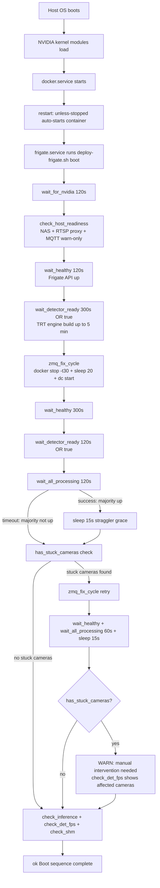
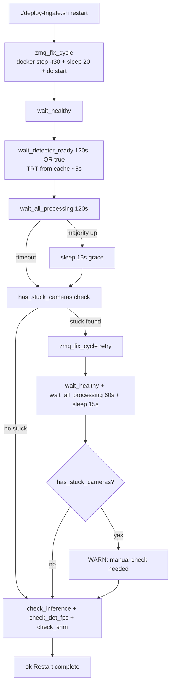
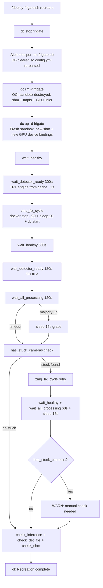

# Frigate Cold-Start & Hot-Start Reliability Plan
**Date**: 2026-06-01  
**Author**: Zoo (Architect)  
**Basis**: Gemini raw analysis (`plans/gemini_raw_analysis`) correlated with direct code analysis

---

## 1. Context: What Has Already Been Done

This project has gone through two prior reliability iterations. Understanding them is essential before changing anything.

### 1.1 Current state of [`deploy-frigate.sh`](../deploy-frigate.sh)

| Fix | Status | Notes |
|-----|--------|-------|
| BUG-1: `${DB_MTIME}` unbound variable crash | ✅ Implemented | auto mode now calls `cmd_recreate` correctly on config change |
| BUG-2: `wait_detector_ready 120 \|\| true` in recreate retry | ✅ Implemented | prevents script exit under `set -e` |
| BUG-3: `wait_detector_ready 300 \|\| true` in cmd_boot | ✅ Implemented | same |
| BUG-4: dynamic `cid` in `check_shm` | ✅ Implemented | Docker Compose V2 compatibility |
| REL-5: `sleep 20` in `zmq_fix_cycle` | ✅ Implemented | port-release safety margin |
| REBOOT-7: `TimeoutStartSec=1800` | ✅ Implemented | covers cold TRT build + retries |
| REL-6: 3-retry while-loop | ❌ Reverted | caused 17-min deploy times (see §1.2) |
| REL-8: strict stuck-camera check | ❌ Reverted | correct logic, wrong timing (see §1.2) |
| REL-9: `MAX_ZMQ_RETRIES=3` | ❌ Reverted | depends on REL-6 |

### 1.2 Why REL-6/8/9 were reverted

From [`plans/revert-reliability-regression-plan.md`](revert-reliability-regression-plan.md):

REL-8 changed `all_processing()` from a majority check (>50% cameras have `process_fps > 0`) to a strict stuck-camera check (`camera_fps > 0` AND `process_fps = 0` on ANY camera). This fired as a false positive: `wait_all_processing` exits early when *majority* are up (e.g. at t=60s), then the strict check runs immediately — some cameras just connected to go2rtc at t=59s and haven't yet received their first ZMQ frame. The strict check sees `camera_fps > 0, process_fps = 0` and triggers a retry. With REL-6's 3-retry loop, each retry costs ~235s → 3 retries × 4 min = 12 min overhead, making every deploy take 15–20 minutes.

**Root cause of regression: the strict check ran too early, not that the logic was wrong.**

---

## 2. Correlated Analysis: Gemini vs. Project Reality

### 2.1 What Gemini got right

| Gemini claim | Reality |
|---|---|
| ZMQ IPC synchronization is the primary deadlock source | ✅ Exactly right. Entire `zmq_fix_cycle` infrastructure exists for this reason. |
| TRT build blocks ZMQ during startup | ✅ Correct — `wait_detector_ready` exists precisely for this timing gate. |
| Post-recreation stop/start cycle is mandatory | ✅ Implemented in `zmq_fix_cycle`, documented in [`docker-compose.calypso.yml`](../docker-compose.calypso.yml) header. |
| SIGTERM → SIGKILL skips ZMQ cleanup | ✅ Mitigated by `docker stop -t 30` (30s graceful timeout). |
| Host hardware/network must be up before container ops | ✅ Valid gap — not currently checked. |

### 2.2 What Gemini got critically wrong

**Gemini Sequence A ("Soft Restart") recommends:**
```bash
docker compose -f docker-compose.calypso.yml restart frigate
```

**This is EXPLICITLY FORBIDDEN in this project.** [`deploy-frigate.sh`](../deploy-frigate.sh) line 18 and the [`docker-compose.calypso.yml`](../docker-compose.calypso.yml) header document this:
> "`docker-compose restart` leaves ZMQ IPC sockets between capture and detect processes in a broken state → det_fps=0 on ALL cameras."

The correct "soft restart" is `docker stop -t 30 CONTAINER_ID && sleep 20 && dc start` — which is exactly what `zmq_fix_cycle()` implements.

**Gemini claims config-only changes need only a restart, not recreation.** This project determined otherwise: Frigate stores parsed configuration in `frigate.db` on the container overlay. A plain restart (stop+start) does NOT re-parse `config.yml` — the stale DB is used. Full recreation with explicit DB cleanup (`rm /config/frigate.db*`) is required for config changes to take effect. `cmd_recreate()` handles this.

### 2.3 What Gemini identified that has NOT been addressed

Gemini's "Host & Hardware Provisioning" phase correctly identifies that GPU kernel modules and network infrastructure must be ready before Docker can use them. Currently `cmd_boot` (called by [`frigate.service`](../frigate.service) on host reboot) has NO checks for:

1. **NVIDIA device node readiness**: After cold boot, the NVIDIA driver may still be loading. `/dev/nvidia0` can appear in `/dev` before the device is fully usable. The container starts immediately via `restart: unless-stopped`, possibly racing with driver init.
2. **NAS mount availability**: `${FRIGATE_MEDIA_PATH}` is an NFS/SMB mount on a NAS. If the NAS is slow to respond post-boot, the path exists as an empty directory. Frigate starts, volume-mounts it, then writes to what it thinks is the NAS — actually local overlay. All recordings go to the wrong place silently.
3. **Network connectivity to dependencies**: If the NUC RTSP proxy (`192.168.50.112:8556`) or MQTT broker (`192.168.50.125:1883`) are unreachable at start, cameras show "no frames received" but there's no early warning in the deploy log.

---

## 3. The Remaining Core Problem

The current `all_processing()` uses a majority (>50%) check. With 11 cameras, this passes when 6+ cameras are healthy — up to 5 cameras can be ZMQ-stuck and the script reports `ok "Restart complete"`. Those 5 cameras then show `det_fps=0` in the UI permanently until the next manual redeploy.

The strict stuck-camera check from REL-8 was conceptually correct. **The regression was caused by firing at the wrong time**, not by flawed logic. The fix is to apply the strict check with a grace period — giving tail cameras time to complete their ZMQ initialization before declaring them stuck.

---

## 4. Design: Two-Phase Readiness Check

### 4.1 The timing insight

After `dc start`:
- **t=0**: container entrypoint runs, `ldconfig`, Frigate Python supervisor starts
- **t=5-15s**: Frigate API comes up (`wait_healthy` exits)
- **t=5-15s**: go2rtc connects to NUC RTSP proxy; internal RTSP loopback starts
- **t=10-30s**: ffmpeg instances connect to internal go2rtc — `camera_fps` rises to > 0
- **t=10-35s**: in healthy ZMQ, `process_fps` appears **within 1-5 seconds** of `camera_fps` (ZMQ message delivery is near-instant once sockets are bound)

If a camera has `camera_fps > 0` and `process_fps = 0` for more than ~15 seconds, it is **definitively ZMQ-stuck** — not still initializing.

### 4.2 The false positive (why REL-8 regressed)

After `wait_all_processing` exits early (e.g. at t=60s when majority from 6/11 cameras are processing):
- Some cameras just connected to go2rtc at t=59s
- The strict check at t=60s sees: `camera_fps > 0 AND process_fps = 0`
- This is a false positive — `process_fps` would appear at t=61-63s

Adding a **15-second grace period** between `wait_all_processing` success and the strict check eliminates this false positive. For a camera that connects at t=59s, the check runs at t=75s — 16 seconds after connection, well beyond the 1-5s window.

### 4.3 Proposed pattern (replaces the `if ! all_processing` block)

```bash
# Phase 1: Wait for majority to show process_fps > 0 (existing behaviour)
# wait_all_processing exits early on success; times out at 120s on failure
if wait_all_processing 120; then
    # Majority healthy. Allow 15s for tail cameras to complete ZMQ init.
    # In healthy state: camera_fps > 0 → process_fps > 0 within 1-5s.
    # 15s grace eliminates false positives from cameras that just connected.
    log "Majority processing. Waiting 15s straggler grace period..."
    sleep 15
fi

# Phase 2: Strict stuck-camera detection (NEW — replaces 'if ! all_processing')
# By this point, any camera with camera_fps > 0 and process_fps = 0
# has been connected to go2rtc for at least 15s without ZMQ delivery.
# That is definitively ZMQ-stuck, not still initializing.
if has_stuck_cameras; then
    warn "Retrying ZMQ fix for cameras above..."
    check_det_fps
    zmq_fix_cycle
    wait_healthy
    wait_detector_ready 120 || true
    wait_all_processing 60 || true
    sleep 15
    if has_stuck_cameras; then
        warn "ZMQ IPC still unhealthy after retry — manual intervention may be needed"
        warn "Run: ./deploy-frigate.sh status  to see per-camera fps"
    fi
fi
```

Note: **still one retry maximum** — the same as the current code. The improvement is that `has_stuck_cameras()` is far more precise than `! all_processing` with majority check, but the retry depth remains the same. This avoids reintroducing the 17-minute regression.

### 4.4 Timing analysis — no regression

```
Normal case (all cameras healthy, ZMQ working):
  wait_all_processing 120  exits early at ~60s
  sleep 15 (grace)                          15s
  has_stuck_cameras()                        ~1s
  Total additional wait:                    ~16s
  Total deploy (post zmq_fix_cycle):        ~76s    ← faster than current 120s timeout

ZMQ-stuck case (some cameras stuck):
  wait_all_processing 120  times out        120s
  has_stuck_cameras()      fires immediately  ~1s
  → 1 retry:
    zmq_fix_cycle                            ~50s
    wait_healthy                             ~60s
    wait_all_processing 60                   ~60s
    sleep 15                                  15s
  Total deploy (post first zmq_fix_cycle):  ~321s ≈ 5.4 min  ← well under pre-regression ~8 min
```

---

## 5. Cold-Start Pre-Flight Checks

Two new functions for `cmd_boot` (host reboot path):

### 5.1 `wait_for_nvidia()`

```bash
wait_for_nvidia() {
    local max_wait="${1:-120}"
    local interval=5
    local elapsed=0
    log "Waiting for NVIDIA GPU devices (timeout=${max_wait}s)..."
    local devices="/dev/nvidia0 /dev/nvidiactl /dev/nvidia-modeset /dev/nvidia-uvm /dev/nvidia-uvm-tools"
    while ! ls $devices >/dev/null 2>&1; do
        sleep "$interval"
        elapsed=$((elapsed + interval))
        if [[ $elapsed -ge $max_wait ]]; then
            warn "NVIDIA devices not ready after ${max_wait}s — container may fail to start GPU inference"
            return 1  # warn only; let Docker attempt start anyway
        fi
        log "  ...NVIDIA devices not ready yet (${elapsed}s)"
    done
    ok "NVIDIA GPU devices ready"
}
```

Called at the very top of `cmd_boot`, before `wait_healthy`. On a normal warm reboot, all device nodes are present in under 5 seconds. The 120s timeout only triggers if the NVIDIA driver failed to load — in which case we warn and continue rather than failing hard (the container will start but GPU inference will fail, which is detectable via `inference_speed`).

### 5.2 `check_host_readiness()`

```bash
check_host_readiness() {
    # NAS mount — warn if media path is not a mountpoint
    local media_path="${FRIGATE_MEDIA_PATH:-/mnt/nas/video/frigate}"
    local nas_base
    nas_base=$(df "$media_path" 2>/dev/null | tail -1 | awk '{print $6}')
    if [[ "$nas_base" == "/" ]] || ! mountpoint -q "$media_path" 2>/dev/null; then
        warn "NAS may not be mounted at ${media_path} — recordings may go to wrong location"
        warn "  Run: mountpoint ${media_path}  to verify"
    else
        ok "NAS mounted at ${media_path}"
    fi

    # NUC RTSP proxy — warn only (go2rtc retries internally)
    if ! timeout 3 bash -c "echo >/dev/tcp/192.168.50.112/8556" 2>/dev/null; then
        warn "NUC RTSP proxy unreachable at 192.168.50.112:8556 — cameras will show no frames until reachable"
    else
        ok "NUC RTSP proxy reachable at 192.168.50.112:8556"
    fi

    # MQTT broker — warn only (Frigate retries MQTT internally)
    if ! timeout 3 bash -c "echo >/dev/tcp/192.168.50.125/1883" 2>/dev/null; then
        warn "MQTT broker unreachable at 192.168.50.125:1883 — HA events won't publish until reachable"
    else
        ok "MQTT broker reachable at 192.168.50.125:1883"
    fi
}
```

Both checks are **warning-only and non-fatal**: `go2rtc` and Frigate handle reconnections internally. The value is early visibility in `journalctl -u frigate-boot` logs so the operator knows immediately which layer failed on a bad cold boot.

### 5.3 New `cmd_boot` sequence

```
1. wait_for_nvidia 120
2. check_host_readiness
3. wait_healthy 120         [Docker auto-started container; wait for API]
4. wait_detector_ready 300 || true  [TRT build up to 5 min]
5. zmq_fix_cycle
6. wait_healthy 300
7. wait_detector_ready 120 || true
8. ─── Two-phase readiness check ───
   if wait_all_processing 120; then sleep 15; fi
   if has_stuck_cameras; then
       → single retry: zmq_fix_cycle + wait_healthy + wait_all_processing 60 + sleep 15
       → if has_stuck_cameras: warn (manual intervention)
   fi
9. check_inference
10. check_det_fps
11. check_shm
12. ok "Boot sequence complete"
```

### 5.4 Updated `frigate.service` TimeoutStartSec

With `wait_for_nvidia` (up to 120s) added to `cmd_boot`, the worst-case calculation becomes:

| Phase | Time |
|---|---|
| `wait_for_nvidia` | up to 120s |
| `check_host_readiness` | ~9s (3 TCP timeouts × 3) |
| `wait_healthy` initial | up to 120s |
| `wait_detector_ready 300` (cold TRT) | up to 300s |
| `zmq_fix_cycle` | ~50s |
| `wait_healthy 300` | up to 300s |
| `wait_all_processing 120` + `sleep 15` | ~135s |
| 1 retry (zmq + healthy + process + sleep) | ~185s |
| **Total worst case** | **~1319s** |

Current `TimeoutStartSec=1800` still has 481s margin. **No change needed to `frigate.service`.**

---

## 6. New `has_stuck_cameras()` Function

```bash
# Returns 0 (success) if any camera has camera_fps > 0 AND process_fps = 0.
# These cameras are definitively ZMQ-stuck: go2rtc is delivering frames but
# Frigate is not processing them — the ZMQ IPC message path is broken.
# Cameras with camera_fps = 0 are excluded — those are RTSP connectivity
# issues, not ZMQ issues; a zmq_fix_cycle won't help them.
# Returns 1 (failure = "no stuck cameras found") if all connected cameras
# are processing, which is the desired state.
has_stuck_cameras() {
    local result
    result=$(curl -sf "${FRIGATE_API}/api/stats" 2>/dev/null \
        | python3 -c "
import sys, json
try:
    s = json.load(sys.stdin)
    cams = s.get('cameras', {})
    stuck = [
        c for c, v in cams.items()
        if (v.get('camera_fps') or 0) > 0         # go2rtc delivering frames
        and (v.get('process_fps') or 0) == 0      # Frigate not processing them
        and v.get('detection_enabled', True)      # detection is active
    ]
    print(','.join(stuck) if stuck else '')
except Exception:
    print('')   # parse failure → assume no stuck cameras; avoid spurious retry
" 2>/dev/null) || result=""

    if [[ -z "$result" ]]; then
        return 1   # no stuck cameras
    else
        warn "ZMQ-stuck cameras (camera_fps>0, process_fps=0): ${result}"
        return 0   # stuck cameras found → caller should retry
    fi
}
```

---

## 7. Complete Change Summary

### 7.1 Changes to [`deploy-frigate.sh`](../deploy-frigate.sh)

| # | Change | Location | Type |
|---|--------|----------|------|
| 1 | ADD `wait_for_nvidia()` function | after `wait_all_processing()` | **New function** |
| 2 | ADD `check_host_readiness()` function | after `wait_for_nvidia()` | **New function** |
| 3 | ADD `has_stuck_cameras()` function | after `check_det_fps()` | **New function** |
| 4 | `cmd_boot`: call `wait_for_nvidia 120` at top (before `wait_healthy`) | line ~281 | **Modify** |
| 5 | `cmd_boot`: call `check_host_readiness` after `wait_for_nvidia` | line ~283 | **Modify** |
| 6 | `cmd_boot`: replace `if ! all_processing` block with two-phase pattern | line ~305 | **Modify** |
| 7 | `cmd_restart`: replace `if ! all_processing` block with two-phase pattern | line ~370 | **Modify** |
| 8 | `cmd_recreate`: replace `if ! all_processing` block with two-phase pattern | line ~462 | **Modify** |

### 7.2 Changes to [`frigate.service`](../frigate.service)

None. `TimeoutStartSec=1800` remains sufficient.

### 7.3 Changes to [`docker-compose.calypso.yml`](../docker-compose.calypso.yml)

None.

---

## 8. Sequence Diagrams

### Cold-Start (host reboot → `frigate.service` → `cmd_boot`)



### Hot-Start A — Config-only change (`cmd_restart`)



### Hot-Start B — Infrastructure change (`cmd_recreate`)



---

## 9. Anti-Pattern Registry (Canonical Reference)

This section documents forbidden patterns that have historically caused failures in this system.

| Anti-pattern | Why forbidden | Correct alternative |
|---|---|---|
| `docker compose restart frigate` | Leaves ZMQ IPC sockets broken → `det_fps=0` on ALL cameras | `docker stop -t 30 CONTAINER_ID && sleep 20 && dc start` via `zmq_fix_cycle()` |
| `docker compose up --force-recreate` | KeyError: 'ContainerConfig' bug in docker-compose v1.29.2 with OCI images | `dc stop && dc rm -f && dc up -d` |
| config-only change → skip recreation | Frigate reads `frigate.db` (stale), ignores `config.yml` changes | Always `cmd_recreate` (with DB clear) on any `config.yml` change |
| `wait_detector_ready` without `\|\| true` | Returns exit code 1 on timeout → `set -e` kills script | Always append `\|\| true` |
| `wait_all_processing` → immediate strict check | False positive for cameras still initializing ZMQ | Add 15s grace period before `has_stuck_cameras()` check |
| >1 ZMQ retry cycle with strict per-camera check | False positives cascade → 17-minute deploy regression | 1 retry max; strict check provides signal, not retry driver |

---

## 10. Files to Modify

| File | Changes |
|------|---------|
| [`deploy-frigate.sh`](../deploy-frigate.sh) | Add 3 new functions; modify 3 command functions (cmd_boot, cmd_restart, cmd_recreate) |
| [`frigate.service`](../frigate.service) | No changes |
| [`docker-compose.calypso.yml`](../docker-compose.calypso.yml) | No changes |

---

## 11. Validation Checklist

- [ ] `./deploy-frigate.sh restart` completes in under 5 min on a healthy system (no retry triggered)
- [ ] `./deploy-frigate.sh recreate` completes in under 7 min (no retry needed on clean ZMQ)
- [ ] After `restart`, `check_det_fps` shows `detection_fps>0` on all reachable cameras
- [ ] `./deploy-frigate.sh boot` logs show `wait_for_nvidia` and `check_host_readiness` output
- [ ] `./deploy-frigate.sh status` shows `/dev/shm` actual values (BUG-4, already working)
- [ ] Simulate ZMQ stuck: verify `has_stuck_cameras()` fires and a retry is triggered
- [ ] Simulate normal startup: verify `has_stuck_cameras()` does NOT fire (no spurious retry)
- [ ] Verify no `set -e` crash paths in new functions (all timeout paths return, not `fail()`)

---

## 12. Diagnostic Command (`cmd_diagnose`)

### 12.1 Purpose and output format

`./deploy-frigate.sh diagnose` produces a five-layer, actionable system health report. Every failure line includes a `→ Fix:` directive so the operator has an immediate response.

**Healthy system output:**
```
=== Frigate System Diagnostics [2026-06-01 11:42:05] ===

HOST LAYER
  NVIDIA devices     ✅  /dev/nvidia0 /dev/nvidiactl /dev/nvidia-modeset /dev/nvidia-uvm /dev/nvidia-uvm-tools
  NAS mount          ✅  /mnt/nas/video/frigate is a mountpoint
  RTSP proxy         ✅  192.168.50.112:8556 reachable
  MQTT broker        ✅  192.168.50.125:1883 reachable

DOCKER LAYER
  Container          ✅  Up 2 hours  (ghcr.io/blakeblackshear/frigate:stable-tensorrt)
  /dev/shm           ✅  2.1G / 5.0G used  (42%)
  /tmp/cache             240M / 2.0G used  (12%)

INFERENCE LAYER
  onnx1 (Tensorrt)   ✅  inference_speed: 6.2ms   [< 10ms = TRT active]
  TRT engine cache   ✅  ./trt-cache populated

ZMQ / IPC LAYER
  ZMQ status         ✅  No stuck cameras detected

CAMERA STREAMS
  Camera                           camera_fps  process_fps  detect_fps   ZMQ
  ─────────────────────────────────────────────────────────────────────────
  allee_sur_le_cote                     0.0          0.0         0.0    — sub
  allee_sur_le_cote_left               10.0         10.0         5.1    ✅
  allee_sur_le_cote_right              10.0         10.0         5.0    ✅
  jardin_arriere                        5.0          5.0         2.1    ✅
  jardin_devant                         0.0          0.0         0.0    — sub
  jardin_devant_left                   10.0         10.0         4.8    ✅
  jardin_devant_right                  10.0         10.0         4.9    ✅
  piscine_vue_toit                      0.0          0.0         0.0    — sub
  piscine_vue_toit_left                10.0         10.0         3.8    ✅
  piscine_vue_toit_right               10.0         10.0         3.9    ✅
  vue_entree                           10.0         10.0         4.9    ✅
  ─────────────────────────────────────────────────────────────────────────
  Active: 8/11   Processing: 8/8   Detecting: 8/8   ZMQ-stuck: 0

SERVICE LAYER
  frigate.service    ✅  inactive/dead  (oneshot — completed successfully)
                         Last boot log: journalctl -u frigate-boot -n 50
```

### 12.2 Failure output examples

**ZMQ stuck cameras detected:**
```
ZMQ / IPC LAYER
  ZMQ status         ❌  2 camera(s) ZMQ-stuck: allee_sur_le_cote_left, jardin_devant_right
                         camera_fps > 0 (RTSP OK) but process_fps = 0 (ZMQ IPC broken)
                         → Fix: ./deploy-frigate.sh restart
```

**NVIDIA device nodes missing (driver still loading after cold boot):**
```
HOST LAYER
  NVIDIA devices     ❌  Missing: /dev/nvidia-uvm /dev/nvidia-uvm-tools
                         NVIDIA UVM kernel module may not be loaded yet
                         → Fix: sudo modprobe nvidia-uvm  OR wait for driver init (~5s after boot)
```

**NAS not mounted (recordings at risk):**
```
HOST LAYER
  NAS mount          ⚠️  /mnt/nas/video/frigate exists but is NOT a mountpoint
                         Recordings will be written to container overlay (data LOSS risk)
                         → Fix: sudo mount -a  OR  check NAS connectivity and /etc/fstab
```

**TRT engine still building (first-ever boot):**
```
INFERENCE LAYER
  onnx1 (Tensorrt)   ⚠️  inference_speed: 0.0ms  (TRT engine building — det_fps=0 is normal)
                         First-run build takes ~65s on RTX 5060 Ti
                         → Wait 2 min then re-run: ./deploy-frigate.sh diagnose
```

**Container not running:**
```
DOCKER LAYER
  Container          ❌  No running container found
                         → Fix: ./deploy-frigate.sh recreate
```

### 12.3 Implementation specification

The `cmd_diagnose` function queries five data sources in order:

| Layer | Data source | Key checks |
|---|---|---|
| HOST | `/dev` filesystem + `mountpoint` + TCP probes | 5 NVIDIA nodes, NAS mountpoint, RTSP proxy, MQTT |
| DOCKER | `docker inspect` + `docker exec df` | container up/down, /dev/shm %, /tmp/cache % |
| INFERENCE | `GET /api/stats` → `detectors` | `inference_speed` > 0, < 10ms = TRT, < 50ms = CUDA, > 50ms = CPU |
| ZMQ/IPC | `GET /api/stats` → `cameras` | `camera_fps > 0 AND process_fps = 0` = stuck (same logic as `has_stuck_cameras`) |
| CAMERAS | `GET /api/stats` → `cameras` | per-camera fps table + summary counts |

**Inference speed thresholds:**

| inference_speed | Status | Symbol |
|---|---|---|
| = 0 (building) | TRT engine building | `⚠️` |
| < 10ms | TRT active | `✅` |
| 10–50ms | CUDA (TRT not loaded) | `⚠️` |
| > 50ms | CPU fallback | `❌` |

**`/dev/shm` thresholds:**

| Usage | Status |
|---|---|
| < 80% | `✅` normal |
| 80–95% | `⚠️` pressure — corrupted frames risk |
| > 95% | `❌` critical — gray/corrupted frames likely |

**Sub-stream cameras** (`allee_sur_le_cote`, `jardin_devant`, `piscine_vue_toit` — the panoramic whole-lens views) have `camera_fps = 0` by design (detection is done via the `_left`/`_right` crop cameras). These are displayed with `— sub` in the ZMQ column, not flagged as failures.

---

## 13. Executable Validation Plan (`cmd_validate`)

### 13.1 Test matrix

#### Tier 1 — Non-destructive snapshot tests (zero service impact)

Run at any time: `./deploy-frigate.sh validate`

| ID | Test | Pass condition | On failure |
|----|------|---------------|------------|
| V1 | API accessible | `GET /api/version` HTTP 200 within 5s | `❌` + suggest `./deploy-frigate.sh recreate` |
| V2 | Inference active | `inference_speed > 0` | `❌` check TRT build status (run `diagnose`) |
| V3 | Inference speed / mode | `inference_speed < 50ms` | `⚠️` if 10–50ms (CUDA), `❌` if > 50ms (CPU fallback) |
| V4 | ZMQ IPC health | `has_stuck_cameras()` returns 1 (no stuck) | `❌` list stuck cameras + suggest `restart` |
| V5 | Camera feeds active | > 50% of detect cameras have `camera_fps > 0` | `⚠️` suggest check RTSP proxy + NUC reachability |
| V6 | Detection running | All cameras with `camera_fps > 0` have `detect_fps > 0` | `❌` ZMQ broken — suggest `restart` |
| V7 | /dev/shm headroom | < 80% used | `⚠️` at 80%, `❌` at 95% |
| V8 | Host NVIDIA devices | All 5 device nodes present | `❌` + `modprobe nvidia-uvm` suggestion |
| V9 | NAS mounted | `mountpoint -q <path>` succeeds | `⚠️` warn (recordings at risk) |

#### Tier 2 — Restart cycle test (service restarts — takes 3–5 min)

Run explicitly: `./deploy-frigate.sh validate restart`

| ID | Test | Pass condition |
|----|------|---------------|
| V10 | Restart completes | exit code 0 + "ok Restart complete" in output |
| V11 | No spurious ZMQ retry | No "ZMQ-stuck cameras detected" in restart output |
| V12 | Restart duration | Completes in < 5 min (regression guard) |
| V13 | Post-restart ZMQ health | `has_stuck_cameras()` returns 1 within 120s after restart |
| V14 | Post-restart detection | All cameras with `camera_fps > 0` have `detect_fps > 0` within 120s |

### 13.2 Expected outputs

**All passing (Tier 1):**
```
=== Frigate Validation Suite [Tier 1 — non-destructive] ===

[V1]  API accessible .............. ✅ PASS  (HTTP 200, 8ms)
[V2]  Inference active ............ ✅ PASS  (inference_speed=6.2ms)
[V3]  Inference speed / mode ...... ✅ PASS  (6.2ms < 10ms: TRT active)
[V4]  ZMQ IPC health .............. ✅ PASS  (0 stuck cameras)
[V5]  Camera feeds active ......... ✅ PASS  (8/8 detect cameras have camera_fps>0)
[V6]  Detection running ........... ✅ PASS  (8/8 active cameras have detect_fps>0)
[V7]  /dev/shm headroom ........... ✅ PASS  (42% used; threshold 80%)
[V8]  Host NVIDIA devices ......... ✅ PASS  (all 5 device nodes present)
[V9]  NAS mount ................... ✅ PASS  (/mnt/nas/video/frigate is mountpoint)

=== RESULT: 9/9 PASS — System verified healthy ===

To test restart reliability: ./deploy-frigate.sh validate restart
```

**With ZMQ failure:**
```
[V4]  ZMQ IPC health .............. ❌ FAIL
        Stuck cameras: allee_sur_le_cote_left, jardin_devant_right
        camera_fps > 0 but process_fps = 0 — ZMQ IPC broken
        → Fix: ./deploy-frigate.sh restart
[V6]  Detection running ........... ❌ FAIL
        6/8 cameras have detect_fps>0 (2 stuck — see V4)

=== RESULT: 7/9 PASS — Action required ===
```

**Tier 2 restart test:**
```
=== Frigate Validation Suite [Tier 2 — restart cycle] ===
Warning: This will restart Frigate (brief camera interruption)

[V10] Restart completes ........... ✅ PASS
[V11] No spurious ZMQ retry ....... ✅ PASS  (grace period: no false positives triggered)
[V12] Restart duration ............ ✅ PASS  (3m42s < 5min threshold)
[V13] Post-restart ZMQ health ..... ✅ PASS  (0 stuck cameras)
[V14] Post-restart detection ...... ✅ PASS  (8/8 cameras detecting within 87s)

=== RESULT: 5/5 PASS — Restart sequence verified reliable ===
```

### 13.3 Cold-start validation procedure (requires actual reboot)

This cannot be automated — it requires an operator at the console. Run after hardware changes, NVIDIA driver updates, or to establish a new reliability baseline.

**Pre-reboot (establish baseline):**
```bash
./deploy-frigate.sh validate          # must be 9/9 PASS before proceeding
./deploy-frigate.sh diagnose          # save for post-reboot comparison
```

**Reboot and monitor:**
```bash
sudo reboot
# After login — watch boot sequence live:
journalctl -u frigate-boot -f
```

**Expected `journalctl` output (warm TRT cache):**
```
frigate-boot: === Boot ZMQ-fix sequence (called by frigate.service) ===
frigate-boot: Waiting for NVIDIA GPU devices (timeout=120s)...
frigate-boot: ✅ NVIDIA GPU devices ready
frigate-boot: ✅ NAS mounted at /mnt/nas/video/frigate
frigate-boot: ✅ NUC RTSP proxy reachable at 192.168.50.112:8556
frigate-boot: ✅ MQTT broker reachable at 192.168.50.125:1883
frigate-boot: Waiting for Frigate API to become available (timeout=120s)...
frigate-boot: ✅ Frigate API is up
frigate-boot: Waiting for detector to become ready (timeout=300s)...
frigate-boot: ✅ Detector model loaded: inference_speed=6.1ms
frigate-boot: ZMQ-fix: stopping container ... (timeout=30s)
frigate-boot: ZMQ-fix: starting frigate...
frigate-boot: ✅ Frigate API is up
frigate-boot: Waiting for majority of cameras to start processing (timeout=120s)...
frigate-boot: ✅ Majority of cameras processing (process_fps > 0)
frigate-boot: Majority processing. Waiting 15s straggler grace period...
frigate-boot: ✅ Boot sequence complete
```

**Post-reboot verification:**
```bash
./deploy-frigate.sh validate          # must return 9/9 PASS
./deploy-frigate.sh diagnose          # ZMQ-stuck must be 0, detect_fps > 0 on all active cameras
```

**Cold TRT cache test** (simulate first-ever boot):
```bash
rm -rf ./trt-cache/tensorrt           # clears engine; jinaai semantic cache untouched
sudo reboot
# journalctl will show wait_detector_ready waiting ~65s before inference_speed > 0
journalctl -u frigate-boot -f
# After boot:
./deploy-frigate.sh validate
```

### 13.4 Hot-start manual validation matrix

Execute once after implementing all changes. All must pass before declaring the system production-ready.

| # | Scenario | Command | Pass condition |
|---|---|---|---|
| H1 | Config change triggers recreation | `touch config.yml && ./deploy-frigate.sh` | Output: "Full recreation required" — no `DB_MTIME: unbound` crash |
| H2 | Restart timing (no changes) | `./deploy-frigate.sh restart` | Completes in < 5 min |
| H3 | No spurious ZMQ retry on clean restart | `./deploy-frigate.sh restart` × 3 | No "ZMQ-stuck cameras detected" in any of 3 runs |
| H4 | Recreation timing | `./deploy-frigate.sh recreate` | Completes in < 8 min total |
| H5 | Config applied after recreation | `./deploy-frigate.sh recreate` then check API | `GET /api/config` returns updated values (not stale DB) |
| H6 | shm correct after recreation | `./deploy-frigate.sh diagnose` after recreate | `/dev/shm` shows 5.0G allocated (shm_size=5120m) |
| H7 | Detection active after restart | `./deploy-frigate.sh validate` after restart | V4 (ZMQ) + V6 (detection) both PASS |
| H8 | Status command shows real shm | `./deploy-frigate.sh status` | `/dev/shm` line shows actual values, not "could not read" |

---

## 14. Updated Files to Modify

| File | Changes | New commands added |
|------|---------|-------------------|
| [`deploy-frigate.sh`](../deploy-frigate.sh) | **5 new functions**: `wait_for_nvidia`, `check_host_readiness`, `has_stuck_cameras`, `cmd_diagnose`, `cmd_validate` · **3 modified**: `cmd_boot`, `cmd_restart`, `cmd_recreate` · **1 modified**: `case` statement + usage string | `diagnose`, `validate`, `validate restart` |
| [`frigate.service`](../frigate.service) | No changes | — |
| [`docker-compose.calypso.yml`](../docker-compose.calypso.yml) | No changes | — |
