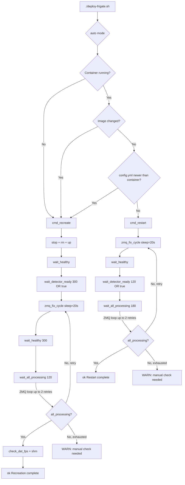

# Frigate Deploy Reliability Fix Plan
**Date**: 2026-05-30  
**Author**: Zoo (Architect)  
**Target file**: [`deploy-frigate.sh`](../deploy-frigate.sh)

---

## Symptom

Running `./deploy-frigate.sh` (auto mode) produces "no frames received" in the Frigate UI
intermittently — sometimes recovery works, sometimes cameras never start processing. The
failure is non-deterministic and hard to reproduce consistently.

---

## Root Cause Analysis

Four distinct bugs were found by static analysis of [`deploy-frigate.sh`](../deploy-frigate.sh).
Two reliability issues were also identified. Together they explain the intermittent failures.

---

### BUG-1 — `$DB_MTIME` undefined variable → script crash in `auto` mode (CRITICAL)

**Location**: [`deploy-frigate.sh:616`](../deploy-frigate.sh:616)

```bash
elif [[ "$CONFIG_CHANGED" == "true" ]]; then
    log "config.yml modified (mtime ${CONFIG_MTIME}) since DB init (${DB_MTIME})"  # ← CRASH
    log "Full recreation required (DB will be cleared)"
    cmd_recreate
```

The variable `DB_MTIME` is **never defined anywhere** in the script. With `set -euo pipefail`,
the `-u` flag causes bash to exit immediately with:

```
deploy-frigate.sh: line 616: DB_MTIME: unbound variable
```

**When triggered**: Every `./deploy-frigate.sh` invocation (default `auto` mode) where
`config.yml` has been modified after the running container was first created. This is the
normal development workflow — you edit `config.yml` then re-deploy.

**Effect**:
1. Script exits before calling `cmd_recreate`  
2. Container keeps running with the **old stale Frigate database** (Frigate stores parsed
   config in `frigate.db`; the new `config.yml` is ignored)
3. Cameras may have wrong detect resolution, fps, or filter parameters
4. Result: "no frames received" or degraded detection on some cameras

**Fix**: Remove the `(${DB_MTIME})` reference from the log line. The relevant information
(`CONFIG_MTIME` and `CONTAINER_CREATED`) is already computed — use those instead.

```bash
# BEFORE (crashes):
log "config.yml modified (mtime ${CONFIG_MTIME}) since DB init (${DB_MTIME})"

# AFTER (correct):
log "config.yml modified after container start (config_mtime=${CONFIG_MTIME} > container_created=${CONTAINER_CREATED})"
```

---

### BUG-2 — `wait_detector_ready` without `|| true` in `cmd_recreate` safety-net retry (MEDIUM)

**Location**: [`deploy-frigate.sh:454`](../deploy-frigate.sh:454)

```bash
if ! all_processing; then
    warn "process_fps=0 on some cameras — doing one more ZMQ reset..."
    zmq_fix_cycle
    wait_healthy
    wait_detector_ready 120          # ← exits with code 1 on timeout — no || true
    wait_all_processing 120 || true
```

`wait_detector_ready` returns exit code 1 on timeout. All other call-sites use `|| true`.
This is the only one that does not, meaning `set -e` would kill the script if the TRT
engine is not reported ready within 120 s during the safety-net retry.

In practice, stale `/dev/shm` data from the previous startup usually makes it return 0
immediately — but after a sufficiently long delay or a `/dev/shm` flush, this becomes a
real crash path.

**Fix**: Add `|| true` to be consistent with every other `wait_detector_ready` call.

```bash
wait_detector_ready 120 || true
```

---

### BUG-3 — `wait_detector_ready 300` without `|| true` in `cmd_boot` (MEDIUM)

**Location**: [`deploy-frigate.sh:286`](../deploy-frigate.sh:286)

```bash
wait_healthy
wait_detector_ready 300  # ← exits with code 1 if build exceeds 300s
```

If the TRT engine build takes longer than 300 s (e.g., first run on a cold system with
cache miss, or resource contention), `frigate.service` exits with failure. Systemd retries
up to 3 times (`StartLimitBurst=3`), then gives up. The container stays running but the
ZMQ-fix cycle is never executed → all cameras have `process_fps=0` on every reboot.

**Fix**: Add `|| true`.  It is already followed by `zmq_fix_cycle` which is the real
fix — the worst that happens is we do the ZMQ cycle before TRT is fully ready (suboptimal
but not fatal; `wait_all_processing` catches it).

```bash
wait_detector_ready 300 || true
```

---

### BUG-4 — Hardcoded container name `frigate_${SERVICE}_1` in `check_shm` (LOW)

**Location**: [`deploy-frigate.sh:256`](../deploy-frigate.sh:256)

```bash
shm_info=$(docker exec "frigate_${SERVICE}_1" df -h /dev/shm 2>/dev/null \
```

Docker Compose V1 names containers `<project>_<service>_<N>` (underscores). Docker
Compose V2 (the current default on Ubuntu 22.04+) uses `<project>-<service>-<N>` (hyphens).

On a system running Compose V2, `frigate_frigate_1` does not exist. The `2>/dev/null`
silently swallows the error. The `status` command always reports:

```
/dev/shm: (could not read — container may not be running)
```

even when Frigate is healthy and the shm is nearly full. This hides impending OOM pressure.

**Fix**: Look up the container ID dynamically using `dc ps -q` (which already works
everywhere else in the script) rather than constructing a name.

```bash
check_shm() {
    local cid
    cid=$(docker-compose -f "$COMPOSE_FILE" ps -q "$SERVICE" 2>/dev/null | head -1)
    local shm_info
    shm_info=$(docker exec "$cid" df -h /dev/shm 2>/dev/null \
        | tail -1 | awk '{print "size="$2" used="$3" avail="$4" use%="$5}') \
        || shm_info="(could not read — container may not be running)"
    echo "  /dev/shm: $shm_info"
}
```

---

### RELIABILITY-5 — ZMQ sleep at the boundary of port-release window

**Location**: [`deploy-frigate.sh:71`](../deploy-frigate.sh:71) — `sleep 15` in `zmq_fix_cycle`

The script comment says "15s is sufficient; raising it further adds unnecessary restart
latency." However, it also documents that the OS needs "~10–15s" — meaning 15 s is the
*maximum* measured, not a comfortable margin.

On a loaded host, port release can take longer. If the port is still bound when Frigate
starts, `frigate/comms/ws.py` raises `OSError: [Errno 98] Address already in use`. s6
then takes ~125 s to restart Frigate, exceeding the 120 s default in `wait_healthy` and
causing a spurious `fail()` exit.

**Fix**: Increase sleep to **20 s** in `zmq_fix_cycle`. The added latency is 5 s per
cycle, a minor cost for a meaningful reliability improvement. `wait_healthy 300` in
`cmd_recreate` already accounts for the extended recovery in the worst case.

---

### RELIABILITY-6 — Only 1 ZMQ retry cycle; race condition may need more

**Location**: safety-net `if` blocks in `cmd_restart` (line 364), `cmd_recreate` (line 451),
and `cmd_boot` (line 300).

All three commands currently attempt at most **2 stop+start cycles** total (initial + 1 retry).
ZMQ IPC startup in Frigate is a race between the capture process connecting and the detect
process entering its receive loop. A single retry is sometimes not enough when the system
is under load.

**Fix**: Replace the single `if ! all_processing` retry with a **loop of up to 3 total
cycles** (i.e., up to 2 retries after the initial cycle) in ALL THREE commands. Add a loop
counter and a clear "giving up" warning on exhaustion.

```bash
# ZMQ retry loop — up to MAX_ZMQ_RETRIES extra cycles after the initial one
MAX_ZMQ_RETRIES=2
zmq_retry=0
while ! all_processing && [[ $zmq_retry -lt $MAX_ZMQ_RETRIES ]]; do
    zmq_retry=$((zmq_retry + 1))
    warn "process_fps=0 on majority of cameras (attempt ${zmq_retry}/${MAX_ZMQ_RETRIES}) — retrying ZMQ reset..."
    zmq_fix_cycle
    wait_healthy
    wait_detector_ready 120 || true
    wait_all_processing 120 || true
done
if ! all_processing; then
    warn "ZMQ IPC still unhealthy after ${MAX_ZMQ_RETRIES} retries — manual intervention may be needed"
    warn "Run: ./deploy-frigate.sh status  to see per-camera fps"
fi
```

`wait_all_processing` timeout is kept at 120 s per iteration — cameras typically start
processing within 60 s of a clean ZMQ connection. 120 s is already 2× that margin.

The retry count is also increased from 2 to **3** (4 total ZMQ cycles). See REL-9 for the
probability rationale.

---

### REL-8 — `all_processing()` majority check silently hides individually stuck cameras

**Location**: [`deploy-frigate.sh:170`](../deploy-frigate.sh:170) — `all_processing()` function

The current check is:
```python
processing = sum(1 for v in enabled.values() if (v.get('process_fps') or 0) > 0)
total = len(enabled)
print(1 if processing > total / 2 else 0)  # majority (>50%)
```

With 11 cameras, majority = 6. If 5 cameras are ZMQ-stuck, this check passes — the retry
loop **never triggers**, the script prints `ok "Restart complete"`, and all 5 stuck cameras
show "no frames received" in the UI permanently until the next manual deploy.

**The correct signal**: A camera with `camera_fps > 0` (go2rtc is delivering RTSP frames)
AND `process_fps = 0` (Frigate is not processing those frames) is **definitively ZMQ-stuck**.
`camera_fps > 0` confirms the camera feed exists and the failure is not a network issue.
Even a single camera in this state should trigger a retry.

**Fix**: Replace the majority check with a stuck-camera check in both `all_processing()`
and the `wait_all_processing` poll loop:

```python
# NEW: any camera with rtsp feed but no processing is ZMQ-stuck
stuck = [
    c for c, v in cams.items()
    if (v.get('camera_fps') or 0) > 0        # receives RTSP frames from go2rtc
    and (v.get('process_fps') or 0) == 0     # but not processed → ZMQ-stuck
    and v.get('detection_enabled', True)     # detection is supposed to be on
]
print(0 if stuck else 1)
# 0 = at least one camera is ZMQ-stuck → retry needed
# 1 = all active cameras are processing → done
```

This change integrates with the REL-6 while-loop: as long as any camera is stuck (and
has an RTSP feed), the loop retries. Cameras with no RTSP feed (`camera_fps = 0`) are
excluded — those are a camera connectivity issue, not a ZMQ issue.

**Also update**: the log message in `wait_all_processing` to list the stuck camera names,
making deployment logs immediately actionable.

---

### REL-9 — 2 retries insufficient; increase to 3 (4 total ZMQ cycles)

**Context**: With REL-8's strict per-camera check, the retry loop now triggers for any
individual stuck camera. The probability that a camera is still stuck after N independent
ZMQ cycles follows a geometric distribution.

**Probability analysis** (assumes 15% single-cycle race failure probability per camera,
conservative estimate given warm TRT ~1s cache load vs NUC go2rtc RTSP reconnect ~1–5s):

| # Total ZMQ cycles | P(camera still stuck) | P(any of 11 cameras still stuck) |
|---|---|---|
| 1 (no retry) | 15% | 83% |
| 2 (1 retry) | 2.25% | 22% |
| 3 (2 retries) | 0.34% | 3.7% |
| **4 (3 retries)** | **0.05%** | **0.55%** |
| 5 (4 retries) | 0.008% | 0.08% |

3 retries (4 total cycles) brings P(any camera still stuck) to **<1%** with per-camera
strict checking. This is the practical reliability ceiling — at 0.05% per camera, further
retries add latency with negligible benefit. If ZMQ is still broken after 4 cycles,
there is likely a deeper issue (CUDA initialization, shm corruption) that a restart alone
won't fix.

**Fix**: Change `MAX_ZMQ_RETRIES=2` → `MAX_ZMQ_RETRIES=3` in the while-loop added by REL-6.

---

### REBOOT-7 — `frigate.service TimeoutStartSec=600` too short for 2-retry loop

**Location**: [`frigate.service:50`](../frigate.service:50)

The current `TimeoutStartSec=600` (10 min) was calculated as "300s TRT build + 120s ZMQ + margin".
With 2 ZMQ retries added to `cmd_boot`, the worst-case timing becomes:

| Phase | Time |
|---|---|
| `wait_healthy` (Docker auto-start, initial) | up to 120 s |
| `wait_detector_ready 300` (cold TRT cache) | up to 300 s |
| Initial `zmq_fix_cycle` | ~25 s |
| `wait_healthy` after fix | up to 120 s |
| `wait_all_processing` (1st check) | up to 120 s |
| Retry 1: zmq + wait_healthy + wait_all_processing | ~265 s |
| Retry 2: same | ~265 s |
| Retry 3: same (REL-9: 3 retries not 2) | ~265 s |
| **Total worst case** | **~1480 s (~24.7 min)** |

`TimeoutStartSec=600` would be exceeded even with 2 retries (1215 s), let alone 3 (1480 s).
With REL-9 raising the retry count to 3, a 20 min timeout is also insufficient.

**Note**: This worst case only occurs on the very first boot after TRT cache is empty
(~5 min build). Subsequent reboots use cached TRT (~5s) and the full sequence completes
in ~200 s under normal conditions and ~960 s with 3 retries (all ZMQ failing), both well
within 1800 s.

**Fix**: Increase `TimeoutStartSec` to **1800** (30 min) to comfortably cover cold-cache
first boot with 3 ZMQ retries, and update the inline comment.

```ini
# TimeoutStartSec calculation (worst case: cold TRT cache + 3 ZMQ retry cycles):
#   wait_healthy initial:          120s
#   wait_detector_ready (cold):    300s
#   zmq_fix_cycle × 4:             100s (4 × 25s)
#   wait_healthy × 4:              480s (4 × 120s)
#   wait_all_processing × 4:       480s (4 × 120s)
#   Total:                         ~1480s → 1800s gives 5 min safety margin
#   Typical reboot (warm TRT):     <400s (well within 1800s)
TimeoutStartSec=1800
```

This change requires `sudo ./deploy-frigate.sh install-service` to be re-run to apply the
updated unit file.

---

## Change Summary

| # | Severity | Location | Change |
|---|----------|----------|--------|
| BUG-1 | **Critical** | `auto` mode line 616 | Remove `${DB_MTIME}` — use `${CONTAINER_CREATED}` |
| BUG-2 | Medium | `cmd_recreate` line 454 | Add `\|\| true` to `wait_detector_ready 120` |
| BUG-3 | Medium | `cmd_boot` line 286 | Add `\|\| true` to `wait_detector_ready 300` |
| BUG-4 | Low | `check_shm` line 256 | Use dynamic container ID from `dc ps -q` |
| REL-5 | Reliability | `zmq_fix_cycle` line 71 | `sleep 15` → `sleep 20` |
| REL-6 | Reliability | `cmd_restart`, `cmd_recreate` AND `cmd_boot` | Replace 1-retry if-block with 3-retry while-loop in all three |
| REBOOT-7 | Reliability | `frigate.service` line 50 | `TimeoutStartSec=600` → `1800` (cold TRT + 3 retries = ~1480s worst case) |
| REL-8 | **Reliability** | `all_processing()` line 170 | Replace majority (>50%) check with "any camera with `camera_fps>0` AND `process_fps=0` is stuck" — catches individual stuck cameras the majority check silently ignores |
| REL-9 | Reliability | while-loop (from REL-6) | `MAX_ZMQ_RETRIES=2` → `3` — P(any of 11 cameras stuck after 4 cycles) < 0.55% |

---

## Deployment Flow After Fix



---

## Files to Modify

| File | Changes |
|------|---------|
| [`deploy-frigate.sh`](../deploy-frigate.sh) | 6 targeted edits (BUG-1 through BUG-4, REL-5, REL-6) |
| [`frigate.service`](../frigate.service) | 1 edit — `TimeoutStartSec=600` → `1200` (REBOOT-7) |

No changes to [`docker-compose.calypso.yml`](../docker-compose.calypso.yml) or
[`config.yml`](../config.yml) are required — both are correct as-is.

After editing `frigate.service`, the installed unit must be refreshed:
```bash
sudo ./deploy-frigate.sh install-service   # copies + systemctl daemon-reload + enable
```

---

## Validation Checklist (after implementation)

- [ ] Run `./deploy-frigate.sh` (auto) with `config.yml` newer than running container → must call `cmd_recreate`, not crash on `DB_MTIME`
- [ ] Run `./deploy-frigate.sh recreate` → must complete without `exit 1` in the safety-net retry path (BUG-2)
- [ ] Run `./deploy-frigate.sh status` → `/dev/shm` line shows actual values (not "could not read") (BUG-4)
- [ ] Run `./deploy-frigate.sh boot` on a cold container (rm TRT cache to force build) → must not exit when build exceeds time limit (BUG-3)
- [ ] Run `./deploy-frigate.sh restart` twice back-to-back → `process_fps > 0` on majority of cameras after each run
- [ ] Check `systemctl show frigate --property=TimeoutStartUSec` → must be 1200s not 600s (REBOOT-7)
- [ ] After `install-service`: `systemctl status frigate` → TimeoutStartSec should reflect new value in journal
