# Detection Parameter Optimisation — v2 Plan

## Executive Summary

Systematic determination of optimal per-camera person detection parameters using controlled walking tests. Each iteration is a git commit containing the config and the raw event data used to derive the parameters. The process starts from wide-open global defaults and tightens parameters based on observed detection statistics.

**Starting point:** Reset all per-camera `objects.filters.person` entries to global defaults. Camera geometry (zones, motion masks, ffmpeg crop definitions) is preserved.

**Walking methodology:** One physical camera unit at a time. All three logical cameras (panoramic overview + left half-crop + right half-crop) of a Duo 3 share the same walk data.

**5 physical cameras → 8 logical cameras → 6 iterations:**

| Iter | Physical Camera | Logical Cameras | Detection Stream |
|------|----------------|-----------------|------------------|
| 1 | allee_sur_le_cote | allee_sur_le_cote, allee_sur_le_cote_left, allee_sur_le_cote_right | sub 1536×432 / main 2048×1152 crops |
| 2 | jardin_arriere | jardin_arriere | main 3840×2160 |
| 3 | vue_entree | vue_entree | main 2560×1920 |
| 4 | jardin_devant | jardin_devant, jardin_devant_left, jardin_devant_right | sub 1536×432 / main 2048×1152 crops |
| 5 | piscine_vue_toit | piscine_vue_toit, piscine_vue_toit_left, piscine_vue_toit_right | sub 1536×432 / main 2048×1152 crops |
| — | Final review | All 8 cameras | — |

---

## 1. Camera Descriptions

### 1.1 allee_sur_le_cote (Reolink Duo 3 — 192.168.50.129)

| Property | Value |
|----------|-------|
| Height | 4 m above ground |
| Mount | Eye-level side view, driveway |
| Angle | Covers gate + approach along driveway |
| Area surveilled | Private driveway, gate entry/exit |
| Detection streams | **panoramic:** sub 1536×432 (full panoramic overview, 3.56:1) · **left:** main 2048×1152 crop · **right:** main 2048×1152 crop |
| Pixel density | Panoramic sub: 663,552 px · Half-crop main: 2,359,296 px (7× more) |

### 1.2 jardin_arriere (Reolink RLC-810A — 192.168.50.207)

| Property | Value |
|----------|-------|
| Height | 2.2 m above ground |
| Mount | North-facing, elevated-ish |
| Angle | Rear garden, play area, shed |
| Area surveilled | Private back garden, children's play area |
| Detection stream | main 3840×2160 (4K UHD, 16:9) |
| Pixel density | 8,294,400 px total |

### 1.3 vue_entree (Reolink Doorbell POE — 192.168.50.222)

| Property | Value |
|----------|-------|
| Height | 1.8 m above ground (doorbell mount) |
| Mount | Front door, near eye level |
| Angle | Entry approach, visitors |
| Area surveilled | Front door, entry path |
| Detection stream | main 2560×1920 (4:3, ~4.9 MP) |
| Pixel density | 4,915,200 px total |

### 1.4 jardin_devant (Reolink Duo 3 — 192.168.50.18)

| Property | Value |
|----------|-------|
| Height | 6.5 m above ground |
| Mount | Roof eave, high angle (≈17° from horizontal) |
| Angle | Front garden, wide overview |
| Area surveilled | Front garden, public sidewalk |
| Detection streams | **panoramic:** sub 1536×432 (full panoramic overview, 3.56:1) · **left:** main 2048×1152 crop · **right:** main 2048×1152 crop |
| Pixel density | Panoramic sub: 663,552 px · Half-crop main: 2,359,296 px |

### 1.5 piscine_vue_toit (Reolink Duo 3 — 192.168.50.7)

| Property | Value |
|----------|-------|
| Height | 6.5 m above ground |
| Mount | Roof, directly above pool |
| Angle | Pool area, overhead |
| Area surveilled | Pool, pool deck, garden beyond |
| Detection streams | **panoramic:** sub 1536×432 (full panoramic overview, 3.56:1) · **left:** main 2048×1152 crop · **right:** main 2048×1152 crop |
| Pixel density | Panoramic sub: 663,552 px · Half-crop main: 2,359,296 px |

---

## 2. Global Default Parameters (iter0 baseline)

These are inherited from `config.yml` global `objects` block — all per-camera overrides are removed in iter0:

```yaml
objects:
  track: [person]
  filters:
    person:
      min_area: 300
      min_score: 0.40
      threshold: 0.45
      max_area: 100000
```

**Rationale:** `min_area=300` is Frigate's documented minimum for a person at typical distances. `threshold=0.45` / `min_score=0.40` are intentionally low to maximise recall during testing — we want to see the full range of true detections before filtering.

---

## 3. Per-Iteration Methodology

### 3.1 Walking Protocol

For each physical camera unit:

1. **Before walking:** Clear Frigate event history (`./deploy-frigate.sh dump` to confirm zero events, or note the cutoff timestamp)
2. **Walk pattern:** Walk along the representative paths a person would take through the camera's FOV. For each camera:
   - **allee_sur_le_cote:** Walk from street gate toward house, then back. Cover both left and right halves of the driveway.
   - **jardin_arriere:** Walk from shed toward house, traverse the play area, walk around the garden perimeter.
   - **vue_entree:** Approach from sidewalk to front door, ring doorbell, step back, walk away.
   - **jardin_devant:** Walk from sidewalk into front garden, approach front door area, walk along garden paths.
   - **piscine_vue_toit:** Walk around the pool perimeter, cross the pool deck, approach from garden side.
3. **Walk count:** 10–15 passes per logical camera (the panoramic overview camera sees the same walk as the half-crop pair, so 10–15 total passes per physical unit).
4. **Speed:** Normal walking pace. Include at least 2–3 slow passes (elderly / child pace) to capture larger, slower-moving detections.
5. **No soak time** — immediately after walking, run the dump script.

### 3.2 Data Collection

After each walk session, run:

```bash
./deploy-frigate.sh dump
```

This produces `frigate_detection_optimisation_dump_iterN.txt` with per-event data:

```
camera, timestamp, score, area_px2, ratio, zones[]
```

### 3.3 Parameter Derivation

For each logical camera, compute from the collected events:

| Parameter | Formula | Safety Margin |
|-----------|---------|---------------|
| `min_area` | p5_area × 0.70 | 30% below observed p5 |
| `max_area` | p95_area × 1.30 | 30% above observed p95 |
| `min_ratio` | p5_ratio × 0.80 | 20% below observed p5 |
| `max_ratio` | p95_ratio × 1.20 | 20% above observed p95 |
| `threshold` | p10_score × 0.95 | 5% below observed p10 |
| `min_score` | p5_score × 0.95 | 5% below observed p5 |

> **p5/p95 chosen over min/max** to exclude outlier events caused by tracking artifacts, occlusions, or rare poses. p10 for threshold because we want to keep 90% of true detections above the threshold.

### 3.4 Data Visibility Requirements

For each iteration, the commit must include:

1. **Raw event dump** — `frigate_detection_optimisation_dump_iterN.txt`
2. **Per-camera summary statistics** — p5/p10/p50/p95 values for area, ratio, score
3. **Violation analysis** — how many events fall outside each parameter bound
4. **Rationale explanation** — why each parameter was set as derived

---

## 4. Iteration Specifications

### Iter 0 — Baseline (git commit: `iter0-baseline`)

**Action:** Remove all per-camera `objects.filters.person` overrides. All 8 logical cameras inherit global defaults.

**Config change:** Delete the `filters.person` block from each camera's `objects` section.

**Verification after deploy:**
- All 8 cameras start without errors
- `det_fps` > 0 for all cameras
- Run `./deploy-frigate.sh dump` — confirm events are being captured with global defaults

**Expected:** High event count (many false positives from wide-open filters), but confirms the detection pipeline is healthy.

---

### Iter 1 — allee_sur_le_cote (git commit: `iter1-allee-sur-le-cote`)

**Physical unit:** allee_sur_le_cote (Reolink Duo 3, 4m height, driveway side view)

**Logical cameras (3):**
- `allee_sur_le_cote` — panoramic sub 1536×432
- `allee_sur_le_cote_left` — main crop 2048×1152
- `allee_sur_le_cote_right` — main crop 2048×1152

**Walk:** 10–15 passes from street gate toward house, covering full driveway width.

**Data output:** `frigate_detection_optimisation_dump_iter1.txt`

**Analysis:** Compute p5/p10/p95 for area, ratio, score per logical camera. Apply derivation formulas. Document violations.

---

### Iter 2 — jardin_arriere (git commit: `iter2-jardin-arriere`)

**Physical unit:** jardin_arriere (Reolink RLC-810A, 2.2m height, rear garden)

**Logical camera (1):** `jardin_arriere` — main 3840×2160

**Walk:** 10–15 passes traversing the rear garden, play area, and shed perimeter.

**Data output:** `frigate_detection_optimisation_dump_iter2.txt`

---

### Iter 3 — vue_entree (git commit: `iter3-vue-entree`)

**Physical unit:** vue_entree (Reolink Doorbell POE, 1.8m height, front door)

**Logical camera (1):** `vue_entree` — main 2560×1920

**Walk:** 10–15 approaches from sidewalk to front door (ring, step back, walk away).

**Data output:** `frigate_detection_optimisation_dump_iter3.txt`

---

### Iter 4 — jardin_devant (git commit: `iter4-jardin-devant`)

**Physical unit:** jardin_devant (Reolink Duo 3, 6.5m height, front garden roof)

**Logical cameras (3):**
- `jardin_devant` — panoramic sub 1536×432
- `jardin_devant_left` — main crop 2048×1152
- `jardin_devant_right` — main crop 2048×1152

**Walk:** 10–15 passes from sidewalk into front garden, approaching front door area.

**Data output:** `frigate_detection_optimisation_dump_iter4.txt`

---

### Iter 5 — piscine_vue_toit (git commit: `iter5-piscine-vue-toit`)

**Physical unit:** piscine_vue_toit (Reolink Duo 3, 6.5m height, pool rooftop)

**Logical cameras (3):**
- `piscine_vue_toit` — panoramic sub 1536×432
- `piscine_vue_toit_left` — main crop 2048×1152
- `piscine_vue_toit_right` — main crop 2048×1152

**Walk:** 10–15 passes around pool perimeter and across pool deck.

**Data output:** `frigate_detection_optimisation_dump_iter5.txt`

---

## 5. Git Commit Convention

Each iteration produces a single git commit containing:

```
iter{N}-{short-name}/
├── config.yml                    # Updated config with new parameters
├── frigate_detection_optimisation_dump_iter{N}.txt   # Raw event data
├── frigate_detection_optimisation_dump_iter{N}-summary.txt  # p5/p10/p95 stats + violation analysis
└── plans/iter{N}-notes.md        # Rationale, observations, decisions
```

Commit message format:

```
iter{N}: {camera name} detection parameters

- Walk data: {N} passes, {date}
- Events captured: {count}
- Key parameter changes:
  - allee_sur_le_cote: min_area={X}, max_area={Y}, threshold={Z}, ...
  - allee_sur_le_cote_left: ...
  - ...
- Data: frigate_detection_optimisation_dump_iter{N}.txt
```

---

## 6. Parameter Derivation Formulas (Reference)

```
min_area  = floor(p5_area   × 0.70)
max_area  = ceil (p95_area  × 1.30)
min_ratio = floor2dp(p5_ratio  × 0.80)
max_ratio = ceil2dp(p95_ratio × 1.20)
threshold = floor2dp(p10_score × 0.95)
min_score = floor2dp(p5_score  × 0.95)
```

Where `floor2dp` / `ceil2dp` round to 2 decimal places.

---

## 7. Mermaid Workflow Diagram

```mermaid
flowchart TD
    subgraph iter0["iter0 — Baseline"]
        A0[Remove all per-camera filters<br/>Global defaults only] --> B0[Deploy config]
        B0 --> C0[Verify all cameras healthy<br/>det_fps > 0]
    end

    subgraph iter1["iter1 — allee_sur_le_cote"]
        A1[Walk driveway<br/>10-15 passes] --> B1[dump events<br/>frigate_detection_optimisation_dump_iter1.txt]
        B1 --> C1[Compute p5/p10/p95 stats<br/>Apply derivation formulas]
        C1 --> D1[Update allee_sur_le_cote<br/>allee_sur_le_cote_left<br/>allee_sur_le_cote_right]
        D1 --> E1[Git commit iter1-allee-sur-le-cote]
    end

    subgraph iter2["iter2 — jardin_arriere"]
        A2[Walk rear garden<br/>10-15 passes] --> B2[dump events<br/>frigate_detection_optimisation_dump_iter2.txt]
        B2 --> C2[Compute p5/p10/p95 stats<br/>Apply derivation formulas]
        C2 --> D2[Update jardin_arriere]
        D2 --> E2[Git commit iter2-jardin-arriere]
    end

    subgraph iter3["iter3 — vue_entree"]
        A3[Walk front door<br/>10-15 passes] --> B3[dump events<br/>frigate_detection_optimisation_dump_iter3.txt]
        B3 --> C3[Compute p5/p10/p95 stats<br/>Apply derivation formulas]
        C3 --> D3[Update vue_entree]
        D3 --> E3[Git commit iter3-vue-entree]
    end

    subgraph iter4["iter4 — jardin_devant"]
        A4[Walk front garden<br/>10-15 passes] --> B4[dump events<br/>frigate_detection_optimisation_dump_iter4.txt]
        B4 --> C4[Compute p5/p10/p95 stats<br/>Apply derivation formulas]
        C4 --> D4[Update jardin_devant<br/>jardin_devant_left<br/>jardin_devant_right]
        D4 --> E4[Git commit iter4-jardin-devant]
    end

    subgraph iter5["iter5 — piscine_vue_toit"]
        A5[Walk pool area<br/>10-15 passes] --> B5[dump events<br/>frigate_detection_optimisation_dump_iter5.txt]
        B5 --> C5[Compute p5/p10/p95 stats<br/>Apply derivation formulas]
        C5 --> D5[Update piscine_vue_toit<br/>piscine_vue_toit_left<br/>piscine_vue_toit_right]
        D5 --> E5[Git commit iter5-piscine-vue-toit]
    end

    C0 --> iter1
    E1 --> iter2
    E2 --> iter3
    E3 --> iter4
    E4 --> iter5
    E5 --> final["Final Review<br/>User approval of all parameters"]
```



---

## 8. Key Decisions and Rationale

| Decision | Rationale |
|----------|-----------|
| Start from global defaults | Removes any bias from previous iterations. Clean slate. |
| Walk one camera at a time | Isolates detection characteristics per camera. Avoids cross-camera noise. |
| Duo 3 left+right share walk data | Same physical position → same person walking paths produce same pixel-level detections. |
| p5/p95 percentiles | Excludes tracking artifacts and rare poses. More robust than min/max. |
| 30% area margin / 20% ratio margin | Accommodates day-to-day variation in lighting, clothing, walking speed. |
| 5% score margin | Small buffer above p5/p10 to reduce missed detections in borderline cases. |
| 10–15 passes per camera | Sufficient for stable p5/p95 estimates without excessive testing time. |
| No soak time | Initial iterations use active walking tests. Soak only if needed for edge cases. |
| Git commit per iteration | Full traceability: config + data + rationale in one commit. |
