# Detection Parameter Optimisation — v2 Plan

## Executive Summary

Systematic determination of optimal per-camera person detection parameters using a two-phase approach:

1. **Phase 1 (iter0):** Physics-based parameter computation using camera geometry (height, tilt, FOV, resolution) to reliably detect a standard 160cm person at the camera's maximum detection distance. **Also includes cleanup of all stale comments and outdated references from previous iterations.**
2. **Phase 2 (iter1+):** Walking tests to validate and fine-tune parameters based on observed detection statistics

**Key insight:** Instead of starting from arbitrary global defaults and iterating blindly, we compute the expected pixel signature of a 160cm person at various distances using trigonometry, then set parameters that guarantee detection of that person with safety margins.

---

## 1. Camera Geometry Reference

### 1.1 allee_sur_le_cote (Reolink Duo 3 — 192.168.50.129)

| Property | Value |
|----------|-------|
| Height | 3.4m above ground |
| Tilt | 50° downward |
| Max distance | 20m (person at ground level) |
| H-FOV | 180° (panoramic) / ~90° per half |
| V-FOV | 55° |
| Detection streams | **panoramic:** sub 1536×432 · **half-crops:** main 2048×1152 |

### 1.2 allee_sur_le_cote_left / allee_sur_le_cote_right

| Property | Value |
|----------|-------|
| Height | 3.4m (inherited from parent) |
| Max distance | 20m (inherited from parent) |
| H-FOV | ~90° (half of 180° panoramic) |
| V-FOV | 55° (inherited from parent) |
| Detection stream | main 2048×1152 (CUDA crop) |

### 1.3 jardin_arriere (Reolink RLC-810A — 192.168.50.207)

| Property | Value |
|----------|-------|
| Height | 2.2m above ground |
| Tilt | 10° downward |
| Max distance | 20m (person at ground level) |
| H-FOV | 87° |
| V-FOV | 44° |
| Detection stream | main 3840×2160 (4K UHD) |

### 1.4 vue_entree (Reolink Doorbell POE — 192.168.50.222)

| Property | Value |
|----------|-------|
| Height | 1.7m above ground |
| Tilt | 0° (eye level) |
| Max distance | 20m (person at ground level) |
| H-FOV | 135° |
| V-FOV | 100° |
| Detection stream | main 2560×1920 (4:3) |

### 1.5 jardin_devant (Reolink Duo 3 — 192.168.50.18)

| Property | Value |
|----------|-------|
| Height | 6m above ground |
| Tilt | 50° downward |
| Max distance | 15m (person at ground level) |
| H-FOV | 180° (panoramic) / ~90° per half |
| V-FOV | 55° |
| Detection streams | **panoramic:** sub 1536×432 · **half-crops:** main 2048×1152 |

### 1.6 jardin_devant_left / jardin_devant_right

| Property | Value |
|----------|-------|
| Height | 6m (inherited from parent) |
| Max distance | 15m (inherited from parent) |
| H-FOV | ~90° (half of 180° panoramic) |
| V-FOV | 55° (inherited from parent) |
| Detection stream | main 2048×1152 (CUDA crop) |

### 1.7 piscine_vue_toit (Reolink Duo 3 — 192.168.50.7)

| Property | Value |
|----------|-------|
| Height | 6m above ground |
| Tilt | 25° downward |
| Max distance | 20m (person at ground level) |
| H-FOV | 180° (panoramic) / ~90° per half |
| V-FOV | 55° |
| Detection streams | **panoramic:** sub 1536×432 · **half-crops:** main 2048×1152 |

### 1.8 piscine_vue_toit_left / piscine_vue_toit_right

| Property | Value |
|----------|-------|
| Height | 6m (inherited from parent) |
| Max distance | 20m (inherited from parent) |
| H-FOV | ~90° (half of 180° panoramic) |
| V-FOV | 55° (inherited from parent) |
| Detection stream | main 2048×1152 (CUDA crop) |

---

## 2. Phase 1: Physics-Based Parameter Computation (iter0)

### 2.1 Cleanup Tasks

Before applying new parameters, clean up all stale content from previous iterations:

| Location | Cleanup Action |
|----------|----------------|
| `config.yml` header | Remove/update outdated comments about "iter2", "soak", "detection-optimisation-plan.md" |
| Camera comments | Remove "iter2 2026-05-25", "iter3 (2026-05-26)" references from filter comments |
| Camera comments | Remove "TEMP iter1: motion masks removed for soak period" comments |
| Camera comments | Remove "VESTIGIAL" comments about disabled go2rtc streams |
| Global defaults | Remove "iter2 — data-driven tight params 2026-05-25" header section |
| Detection params | Remove all per-camera p5/p95 statistics from comments (superseded by physics calc) |
| Motion masks | Restore proper motion masks where "TEMP iter1: masks removed" applies |

### 2.2 Target Person Model

| Property | Value |
|----------|-------|
| Height | 160cm (1.6m) |
| Shoulder width | 50cm (0.5m) |
| Depth | 25cm (0.25m) |
| Aspect ratio (standing) | ~2:1 (height:width) |

### 2.2 Detection Distance Strategy

For each camera, compute parameters at two critical distances:

1. **Near distance:** 3m (close-range, larger pixels)
2. **Far distance:** max_distance (edge of detection range)

The `min_area` parameter is set to catch a 160cm person at the **far distance** (smallest expected footprint).

### 2.3 Pixel Geometry Formulas

Given a camera at height `h` with tilt `θ` degrees from horizontal, a person of height `H` at ground distance `d`:

```
Slant range r = √(d² + h²)
Elevation angle from camera = arctan(h/d)
Depression angle to person = θ - arctan(h/d)
Vertical pixel height = H × (V-FOV degrees / frame height pixels) × cos(depression angle)
Horizontal pixel width = shoulder_width × (H-FOV degrees / frame width pixels) × cos(depression angle)
Area (px²) = pixel_height × pixel_width
Aspect ratio = pixel_height / pixel_width
```

### 2.4 iter0 Parameters Per Camera

#### allee_sur_le_cote (panoramic sub 1536×432)

| Parameter | Formula | Value |
|-----------|---------|-------|
| Detection resolution | 1536×432 | — |
| V-FOV | 55° | — |
| H-FOV | 180° | — |
| Person at 20m: pixel_height | 1.6 × (55/432) × cos(50°-9.7°) | ~31 px |
| Person at 20m: pixel_width | 0.5 × (180/1536) × cos(50°-9.7°) | ~8 px |
| Person at 20m: area | 31 × 8 | ~248 px² |
| Person at 3m: area | ~15,000 px² | — |
| **min_area** | 248 × 0.50 (50% margin) | **124** |
| **max_area** | 15,000 × 1.50 (150% margin) | **22,500** |
| **min_ratio** | 2.0 × 0.50 | **1.0** |
| **max_ratio** | 2.0 × 2.00 | **4.0** |
| **threshold** | Model default + 0.10 | **0.55** |
| **min_score** | Model default + 0.05 | **0.45** |

#### allee_sur_le_cote_left / allee_sur_le_cote_right (main crop 2048×1152)

| Parameter | Formula | Value |
|-----------|---------|-------|
| Detection resolution | 2048×1152 | — |
| V-FOV | 55° | — |
| H-FOV | ~90° | — |
| Person at 20m: pixel_height | 1.6 × (55/1152) × cos(50°-9.7°) | ~12 px |
| Person at 20m: pixel_width | 0.5 × (90/2048) × cos(50°-9.7°) | ~3 px |
| Person at 20m: area | 12 × 3 | ~36 px² |
| Person at 3m: area | ~6,000 px² | — |
| **min_area** | 36 × 0.50 (50% margin) | **18** |
| **max_area** | 6,000 × 1.50 (150% margin) | **9,000** |
| **min_ratio** | 2.0 × 0.50 | **1.0** |
| **max_ratio** | 2.0 × 2.00 | **4.0** |
| **threshold** | 0.55 | **0.55** |
| **min_score** | 0.45 | **0.45** |

#### jardin_arriere (main 3840×2160)

| Parameter | Formula | Value |
|-----------|---------|-------|
| Detection resolution | 3840×2160 | — |
| V-FOV | 44° | — |
| H-FOV | 87° | — |
| Person at 20m: pixel_height | 1.6 × (44/2160) × cos(10°-6.3°) | ~52 px |
| Person at 20m: pixel_width | 0.5 × (87/3840) × cos(10°-6.3°) | ~17 px |
| Person at 20m: area | 52 × 17 | ~884 px² |
| Person at 3m: area | ~78,000 px² | — |
| **min_area** | 884 × 0.50 (50% margin) | **442** |
| **max_area** | 78,000 × 1.50 (150% margin) | **117,000** |
| **min_ratio** | 2.0 × 0.50 | **1.0** |
| **max_ratio** | 2.0 × 2.00 | **4.0** |
| **threshold** | 0.55 | **0.55** |
| **min_score** | 0.45 | **0.45** |

#### vue_entree (main 2560×1920)

| Parameter | Formula | Value |
|-----------|---------|-------|
| Detection resolution | 2560×1920 | — |
| V-FOV | 100° | — |
| H-FOV | 135° | — |
| Person at 20m: pixel_height | 1.6 × (100/1920) × cos(0°) | ~83 px |
| Person at 20m: pixel_width | 0.5 × (135/2560) × cos(0°) | ~26 px |
| Person at 20m: area | 83 × 26 | ~2,158 px² |
| Person at 3m: area | ~96,000 px² | — |
| **min_area** | 2158 × 0.50 (50% margin) | **1,079** |
| **max_area** | 96,000 × 1.50 (150% margin) | **144,000** |
| **min_ratio** | 2.0 × 0.50 | **1.0** |
| **max_ratio** | 2.0 × 2.00 | **4.0** |
| **threshold** | 0.55 | **0.55** |
| **min_score** | 0.45 | **0.45** |

#### jardin_devant (panoramic sub 1536×432)

| Parameter | Formula | Value |
|-----------|---------|-------|
| Detection resolution | 1536×432 | — |
| V-FOV | 55° | — |
| H-FOV | 180° | — |
| Person at 15m: pixel_height | 1.6 × (55/432) × cos(50°-21.8°) | ~24 px |
| Person at 15m: pixel_width | 0.5 × (180/1536) × cos(50°-21.8°) | ~6 px |
| Person at 15m: area | 24 × 6 | ~144 px² |
| Person at 3m: area | ~9,000 px² | — |
| **min_area** | 144 × 0.50 (50% margin) | **72** |
| **max_area** | 9,000 × 1.50 (150% margin) | **13,500** |
| **min_ratio** | 2.0 × 0.50 | **1.0** |
| **max_ratio** | 2.0 × 2.00 | **4.0** |
| **threshold** | 0.55 | **0.55** |
| **min_score** | 0.45 | **0.45** |

#### jardin_devant_left / jardin_devant_right (main crop 2048×1152)

| Parameter | Formula | Value |
|-----------|---------|-------|
| Detection resolution | 2048×1152 | — |
| V-FOV | 55° | — |
| H-FOV | ~90° | — |
| Person at 15m: pixel_height | 1.6 × (55/1152) × cos(50°-21.8°) | ~9 px |
| Person at 15m: pixel_width | 0.5 × (90/2048) × cos(50°-21.8°) | ~2 px |
| Person at 15m: area | 9 × 2 | ~18 px² |
| Person at 3m: area | ~3,500 px² | — |
| **min_area** | 18 × 0.50 (50% margin) | **9** |
| **max_area** | 3,500 × 1.50 (150% margin) | **5,250** |
| **min_ratio** | 2.0 × 0.50 | **1.0** |
| **max_ratio** | 2.0 × 2.00 | **4.0** |
| **threshold** | 0.55 | **0.55** |
| **min_score** | 0.45 | **0.45** |

#### piscine_vue_toit (panoramic sub 1536×432)

| Parameter | Formula | Value |
|-----------|---------|-------|
| Detection resolution | 1536×432 | — |
| V-FOV | 55° | — |
| H-FOV | 180° | — |
| Person at 20m: pixel_height | 1.6 × (55/432) × cos(25°-16.7°) | ~35 px |
| Person at 20m: pixel_width | 0.5 × (180/1536) × cos(25°-16.7°) | ~9 px |
| Person at 20m: area | 35 × 9 | ~315 px² |
| Person at 3m: area | ~18,000 px² | — |
| **min_area** | 315 × 0.50 (50% margin) | **158** |
| **max_area** | 18,000 × 1.50 (150% margin) | **27,000** |
| **min_ratio** | 2.0 × 0.50 | **1.0** |
| **max_ratio** | 2.0 × 2.00 | **4.0** |
| **threshold** | 0.55 | **0.55** |
| **min_score** | 0.45 | **0.45** |

#### piscine_vue_toit_left / piscine_vue_toit_right (main crop 2048×1152)

| Parameter | Formula | Value |
|-----------|---------|-------|
| Detection resolution | 2048×1152 | — |
| V-FOV | 55° | — |
| H-FOV | ~90° | — |
| Person at 20m: pixel_height | 1.6 × (55/1152) × cos(25°-16.7°) | ~14 px |
| Person at 20m: pixel_width | 0.5 × (90/2048) × cos(25°-16.7°) | ~3 px |
| Person at 20m: area | 14 × 3 | ~42 px² |
| Person at 3m: area | ~7,500 px² | — |
| **min_area** | 42 × 0.50 (50% margin) | **21** |
| **max_area** | 7,500 × 1.50 (150% margin) | **11,250** |
| **min_ratio** | 2.0 × 0.50 | **1.0** |
| **max_ratio** | 2.0 × 2.00 | **4.0** |
| **threshold** | 0.55 | **0.55** |
| **min_score** | 0.45 | **0.45** |

### 2.5 iter0 Config Block

```yaml
# iter0: Physics-based parameters for 160cm person detection
# Computed from camera geometry (height, tilt, FOV, resolution)

cameras:
  allee_sur_le_cote:
    objects:
      filters:
        person:
          min_area: 124
          max_area: 22500
          min_ratio: 1.0
          max_ratio: 4.0
          threshold: 0.55
          min_score: 0.45

  allee_sur_le_cote_left:
    objects:
      filters:
        person:
          min_area: 18
          max_area: 9000
          min_ratio: 1.0
          max_ratio: 4.0
          threshold: 0.55
          min_score: 0.45

  allee_sur_le_cote_right:
    objects:
      filters:
        person:
          min_area: 18
          max_area: 9000
          min_ratio: 1.0
          max_ratio: 4.0
          threshold: 0.55
          min_score: 0.45

  jardin_arriere:
    objects:
      filters:
        person:
          min_area: 442
          max_area: 117000
          min_ratio: 1.0
          max_ratio: 4.0
          threshold: 0.55
          min_score: 0.45

  vue_entree:
    objects:
      filters:
        person:
          min_area: 1079
          max_area: 144000
          min_ratio: 1.0
          max_ratio: 4.0
          threshold: 0.55
          min_score: 0.45

  jardin_devant:
    objects:
      filters:
        person:
          min_area: 72
          max_area: 13500
          min_ratio: 1.0
          max_ratio: 4.0
          threshold: 0.55
          min_score: 0.45

  jardin_devant_left:
    objects:
      filters:
        person:
          min_area: 9
          max_area: 5250
          min_ratio: 1.0
          max_ratio: 4.0
          threshold: 0.55
          min_score: 0.45

  jardin_devant_right:
    objects:
      filters:
        person:
          min_area: 9
          max_area: 5250
          min_ratio: 1.0
          max_ratio: 4.0
          threshold: 0.55
          min_score: 0.45

  piscine_vue_toit:
    objects:
      filters:
        person:
          min_area: 158
          max_area: 27000
          min_ratio: 1.0
          max_ratio: 4.0
          threshold: 0.55
          min_score: 0.45

  piscine_vue_toit_left:
    objects:
      filters:
        person:
          min_area: 21
          max_area: 11250
          min_ratio: 1.0
          max_ratio: 4.0
          threshold: 0.55
          min_score: 0.45

  piscine_vue_toit_right:
    objects:
      filters:
        person:
          min_area: 21
          max_area: 11250
          min_ratio: 1.0
          max_ratio: 4.0
          threshold: 0.55
          min_score: 0.45
```

---

## 3. Phase 2: Walking Tests (iter1+)

### 3.1 Walking Protocol

For each physical camera unit:

1. **Before walking:** Clear or note the event cutoff timestamp
2. **Walk pattern:** Walk along representative paths a person would take through the camera's FOV
3. **Walk count:** 10–15 passes per physical unit
4. **Speed:** Normal walking pace. Include 2–3 slow passes (elderly / child pace)
5. **Immediately after walking:** Run `./deploy-frigate.sh dump`

### 3.2 Data Collection

```bash
./deploy-frigate.sh dump
```

Produces `frigate_detection_optimisation_dump_iter{N}.txt` with:
```
camera, timestamp, score, area_px2, ratio, zones[]
```

### 3.3 Parameter Refinement Formula

For each logical camera, compute from collected events:

| Parameter | Formula | Safety Margin |
|-----------|---------|---------------|
| `min_area` | p5_area × 0.70 | 30% below observed p5 |
| `max_area` | p95_area × 1.30 | 30% above observed p95 |
| `min_ratio` | p5_ratio × 0.80 | 20% below observed p5 |
| `max_ratio` | p95_ratio × 1.20 | 20% above observed p95 |
| `threshold` | p10_score × 0.95 | 5% below observed p10 |
| `min_score` | p5_score × 0.95 | 5% below observed p5 |

---

## 4. Iteration Specifications

### Iter 0 — Physics Baseline (git commit: `iter0-physics-baseline`)

**Actions:**

1. **Cleanup:** Remove all stale comments and outdated references from config.yml:
   - Remove/update "iter2", "iter3", "soak" references from header and camera comments
   - Remove p5/p95 statistics from filter comments (superseded by physics calc)
   - Restore proper motion masks where "TEMP iter1: masks removed" applies
   - Remove "VESTIGIAL" comments about disabled go2rtc streams

2. **Apply physics-based parameters:** Set per-camera `objects.filters.person` using computed values from Section 2

**Verification after deploy:**
- All 11 cameras start without errors
- `det_fps` > 0 for all cameras
- Run walking test and confirm 160cm person is detected at max_distance

---

### Iter 1 — allee_sur_le_cote (git commit: `iter1-allee-sur-le-cote`)

**Physical unit:** allee_sur_le_cote (Reolink Duo 3, 3.4m height, driveway side view)

**Logical cameras (3):** `allee_sur_le_cote`, `allee_sur_le_cote_left`, `allee_sur_le_cote_right`

**Walk:** 10–15 passes from street gate toward house.

---

### Iter 2 — jardin_arriere (git commit: `iter2-jardin-arriere`)

**Physical unit:** jardin_arriere (Reolink RLC-810A, 2.2m height, rear garden)

**Logical camera (1):** `jardin_arriere`

**Walk:** 10–15 passes traversing the rear garden.

---

### Iter 3 — vue_entree (git commit: `iter3-vue-entree`)

**Physical unit:** vue_entree (Reolink Doorbell POE, 1.7m height, front door)

**Logical camera (1):** `vue_entree`

**Walk:** 10–15 approaches from sidewalk to front door.

---

### Iter 4 — jardin_devant (git commit: `iter4-jardin-devant`)

**Physical unit:** jardin_devant (Reolink Duo 3, 6m height, front garden)

**Logical cameras (3):** `jardin_devant`, `jardin_devant_left`, `jardin_devant_right`

**Walk:** 10–15 passes from sidewalk into front garden.

---

### Iter 5 — piscine_vue_toit (git commit: `iter5-piscine-vue-toit`)

**Physical unit:** piscine_vue_toit (Reolink Duo 3, 6m height, pool rooftop)

**Logical cameras (3):** `piscine_vue_toit`, `piscine_vue_toit_left`, `piscine_vue_toit_right`

**Walk:** 10–15 passes around pool perimeter.

---

## 5. Git Commit Convention

```
iter{N}-{short-name}/
├── config.yml                    # Updated config with parameters
├── frigate_detection_optimisation_dump_iter{N}.txt   # Raw event data
├── frigate_detection_optimisation_dump_iter{N}-summary.txt  # p5/p10/p95 stats
└── plans/iter{N}-notes.md        # Rationale, observations, decisions
```

---

## 6. Mermaid Workflow Diagram

```mermaid
flowchart TD
    subgraph phase1["Phase 1 — iter0 Physics Baseline"]
        A0[Compute camera geometry<br/>height, tilt, FOV, resolution] --> B0[Calculate 160cm person<br/>pixel signature at max_distance]
        B0 --> C0[Apply safety margins<br/>50% for min, 150% for max]
        C0 --> D0[Deploy iter0 config]
        D0 --> E0[Walking test verification<br/>Confirm 160cm person detected]
    end

    subgraph phase2["Phase 2 — Walking Tests"]
        E0 --> F1[Walk allee_sur_le_cote<br/>10-15 passes]
        F1 --> G1[dump events<br/>Compute p5/p10/p95]
        G1 --> H1[Refine parameters<br/>Apply derivation formulas]
        H1 --> F2[Walk jardin_arriere<br/>10-15 passes]
        F2 --> G2[dump events<br/>Compute p5/p10/p95]
        G2 --> H2[Refine parameters]
        H2 --> F3[Walk vue_entree<br/>10-15 passes]
        F3 --> G3[dump events<br/>Compute p5/p10/p95]
        G3 --> H3[Refine parameters]
        H3 --> F4[Walk jardin_devant<br/>10-15 passes]
        F4 --> G4[dump events<br/>Compute p5/p10/p95]
        G4 --> H4[Refine parameters]
        H4 --> F5[Walk piscine_vue_toit<br/>10-15 passes]
        F5 --> G5[dump events<br/>Compute p5/p10/p95]
        G5 --> H5[Refine parameters]
    end

    H5 --> final["Final Review<br/>User approval of all parameters"]
```



---

## 7. Key Decisions and Rationale

| Decision | Rationale |
|----------|-----------|
| Physics-based iter0 | Guarantees detection of 160cm person at max_distance without relying on arbitrary defaults |
| 50% margin for min_area | Accommodates variation in person size, posture, and detection angle |
| 150% margin for max_area | Allows for close-range detections and tracking artifacts |
| 160cm person model | Standard adult height; represents the primary detection target |
| Walking tests after iter0 | Validates physics calculations and captures real-world detection characteristics |
| p5/p95 percentiles for refinement | Excludes tracking artifacts and rare poses |
