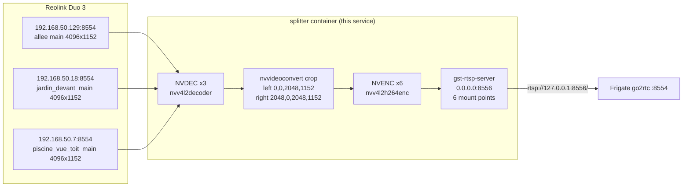

# Reolink Duo 3 Half-Crop Splitter Service

A dedicated, independent of Frigate, GPU-accelerated service that takes the 3
**Reolink Duo 3** main streams (4096×1152, panoramic, 3.55:1) and splits each
one into two **2048×1152 (16:9)** halves, re-publishing the 6 H.264 streams as
RTSP on port 8556. Frigate's `go2rtc.streams` consumes the 6 new streams and
feeds them to 6 new `cameras:` blocks (full roles: detect + record + audio + live).

## Why

The Frigate+ custom model is trained on 1:1 and 16:9 imagery. A 3.55:1
panoramic input is non-uniformly resampled to 320×320 inside the model,
distorting objects and shrinking people (H_px × W_px is much smaller per
person on the panoramic than on a 16:9 half). Splitting the panorama into
two 16:9 halves:

- **Triples the pixel area per person** at the same distance (H_px × W_px ≈ 3× on
  the half vs the panoramic, for the same physical scene).
- Gives the model an input aspect ratio (16:9) that matches its training
  distribution (COCO-like).
- Lets the 2 halves carry independent zones / alerts (left vs right) so
  one person on one side of the panorama doesn't suppress an event on the
  other.

The 3 original panoramic cameras stay in Frigate (record + live + audio) for
the panoramic overview.

## Architecture



## GPU pipeline (per half)

```
rtspsrc location="rtsp://admin:…@192.168.50.X:8554/h264Preview_01_main" protocols=tcp latency=0
  ! application/x-rtp,media=video,encoding-name=H264,clock-rate=90000
  ! rtph264depay
  ! h264parse
  ! nvv4l2decoder                                                            # NVDEC
  ! nvvidconv left=<0|2048> top=0 width=2048 height=1152 flip-method=0       # VIC / CUDA crop
  ! video/x-raw(memory:NVMM),width=2048,height=1152,format=NV12,framerate=15/1
  ! nvv4l2h264enc bitrate=8000000 idrinterval=30 insert-sps-pps=true maxperf-enable=true   # NVENC
  ! h264parse config-interval=1
  ! rtph264pay name=pay0 pt=96 config-interval=1
```

| Stage | Element | Hardware | Per pipeline | Total (6) |
|---|---|---|---|---|
| Decode | `nvv4l2decoder` | NVDEC | 1× 4K stream | 3× 4K concurrent |
| Crop | `nvvidconv` | VIC / CUDA | 1× crop+passthrough | 6× |
| Encode | `nvv4l2h264enc` | NVENC | 1× 2048×1152 | 6× |
| Server | `gst-rtsp-server` | (CPU) | 1× thread | 6× |

CPU participation: only the RTSP handshake, the GStreamer bus, and the
gst-rtsp-server thread pool. Every pixel-touching stage runs on the
RTX 5060 Ti.

## RTSP mount points exposed

| Mount | Source | Output | Mount |
|---|---|---|---|
| `/allee_sur_le_cote_left` | `192.168.50.129:8554/h264Preview_01_main` | 2048×1152, 16:9, left half | left |
| `/allee_sur_le_cote_right` | same | right half | right |
| `/jardin_devant_left` | `192.168.50.18:8554/h264Preview_01_main` | left half | left |
| `/jardin_devant_right` | same | right half | right |
| `/piscine_vue_toit_left` | `192.168.50.7:8554/h264Preview_01_main` | left half | left |
| `/piscine_vue_toit_right` | same | right half | right |

All on `rtsp://127.0.0.1:8556/<mount>` (the host's loopback). Frigate's
`go2rtc.streams` entries in `config.yml` point at these URLs.

## Files

| File | Role |
|---|---|
| `split_service.py` | Python GStreamer service — 6 factories, gst-rtsp-server on :8556 |
| `Dockerfile` | `nvidia/cuda:12.4.1-runtime-ubuntu22.04` + GStreamer 1.20 + NVIDIA plugins |
| `entrypoint.sh` | Wait for nvidia device nodes, sanity-check plugins, exec the service |
| `docker-compose.splitter.yml` | Compose file (nvidia runtime, host network, restart unless-stopped) |
| `requirements.txt` | Python deps (currently empty; PyGObject is from apt) |
| `README.md` | This file |

## Quick start

```bash
# Build
cd splitter
docker build -t frigate-splitter:local .

# Up
docker compose -f splitter/docker-compose.splitter.yml up -d

# Verify the 6 RTSP mounts are alive
for m in allee_sur_le_cote_left allee_sur_le_cote_right \
         jardin_devant_left jardin_devant_right \
         piscine_vue_toit_left piscine_vue_toit_right; do
    timeout 3 ffprobe -v error -of json -show_streams \
        "rtsp://127.0.0.1:8556/$m" \
        | python3 -c "import json,sys; d=json.load(sys.stdin); s=d['streams'][0]; print(f'{sys.argv[1]:28s} {s[\"codec_name\"]:5s} {s[\"width\"]}x{s[\"height\"]}')" "$m" \
        || echo "FAIL: $m"
done

# Tail logs
docker logs -f splitter

# Stop
docker compose -f splitter/docker-compose.splitter.yml down
```

## Environment variables (compose override or env file)

| Var | Default | Meaning |
|---|---|---|
| `LOG_LEVEL` | `INFO` | Python logging level |
| `RTSP_PORT` | `8556` | gst-rtsp-server bind port |
| `BITRATE_BPS` | `8000000` | NVENC target bitrate (8 Mbps) |
| `IDR_INTERVAL_FRAMES` | `30` | GOP length (IDR every N frames) |
| `FRAMERATE` | `15` | Output fps (must match Reolink main) |
| `SOURCE_W` | `4096` | Reolink main width (sanity check) |
| `SOURCE_H` | `1152` | Reolink main height (sanity check) |
| `GST_DEBUG` | `2` | GStreamer debug (0-7) |

## Failure modes & troubleshooting

| Symptom | Likely cause | Fix |
|---|---|---|
| Container exits with "NVIDIA devices not visible after 30s" | nvidia runtime not registered | `sudo nvidia-ctk runtime configure --runtime=docker && sudo systemctl restart docker` |
| Container exits with "FATAL: gst-inspect-1.0 nvv4l2decoder failed" | NVIDIA GStreamer packages missing | Check the Dockerfile build log; the `ruffy8919` PPA may be down — try `apt-cache search nvidia-gst-plugins-bad` on the host |
| `nc -z 127.0.0.1 8556` fails | Python service crashed | `docker logs splitter` — look for GStreamer bus ERROR messages |
| Frigate shows the 6 new cameras in "disabled" state | splitter is up but a Reolink upstream is down | Check `docker logs splitter` for `rtspsrc` errors; verify the camera is reachable on TCP 8554 |
| ffprobe hangs on `rtsp://127.0.0.1:8556/<mount>` | The factory has no clients yet and is lazy-spawned; first connection triggers NVDEC warmup (~5s for 4K) | Wait 5-10s; the second ffprobe will be instant |
| GPU utilisation at 100% on RTX 5060 Ti when 1 client is connected | 3× NVDEC + 6× NVENC saturates the GPU; expected | Reduce `FRAMERATE` to 10 or `BITRATE_BPS` to 5 Mbps in the env if the GPU is shared with Frigate's detection |

## Integration with Frigate

The 6 RTSP mounts above are added to `config.yml` under `go2rtc.streams:`
and consumed by 6 new `cameras:` blocks (see the parent commit's
`config.yml` diff for the full schema). The 3 original panoramic cameras
(allee_sur_le_cote, jardin_devant, piscine_vue_toit) stay as they are
today (record + live + audio + detect via their `*_sub` stream), giving
the operator two independent detection surfaces: panoramic overview and
half-cropped 16:9 with much better model fit.

Total Frigate cameras: **11** (5 outdoor Reolink original + 6 new
half-cropped) + 3 indoor Tapo = 8 + 6 = **14 cameras** (the 3 panoramic
Duo 3 are counted once; the 6 new half-cropped are additional).

## Why a separate service (not in Frigate)?

- **Independent lifecycle**: the splitter can be restarted / upgraded
  without touching Frigate. Frigate's go2rtc reconnects to the new
  splitter on its own back-off.
- **GPU isolation**: the splitter's NVDEC + NVENC is decoupled from
  Frigate's TRT inference. Each can be tuned independently.
- **Reusability**: the 6 RTSP streams can be consumed by any RTSP
  client (Frigate, Home Assistant, OBS, a browser, etc.) without
  going through Frigate.
- **Failure containment**: if the splitter dies, the 3 original
  panoramic cameras + the 2 single-lens Reolink cameras + the 3
  indoor Tapo cameras all keep working. The 6 new half-cropped
  cameras go into "disabled" until the watchdog restarts the splitter.
